# 模态对话框系统

<cite>
**本文档引用的文件**
- [index.html](file://index.html)
- [script.js](file://js/script.js)
- [color-picker.js](file://js/color-picker.js)
- [style.css](file://styles/style.css)
</cite>

## 目录
1. [简介](#简介)
2. [项目结构](#项目结构)
3. [核心组件](#核心组件)
4. [架构概览](#架构概览)
5. [详细组件分析](#详细组件分析)
6. [依赖关系分析](#依赖关系分析)
7. [性能考虑](#性能考虑)
8. [故障排除指南](#故障排除指南)
9. [结论](#结论)
10. [附录](#附录)

## 简介

本项目实现了一个基于Bootstrap的模态对话框系统，专门用于展示教程内容和引导用户使用应用程序。该系统采用响应式设计，支持多种设备和屏幕尺寸，提供了完整的用户交互体验。

模态对话框系统的核心功能包括：
- Bootstrap模态框的初始化和配置
- 动态内容加载和切换
- 响应式布局适配
- 用户交互反馈机制
- 自定义样式和动画效果

## 项目结构

该项目采用模块化架构，主要文件组织如下：

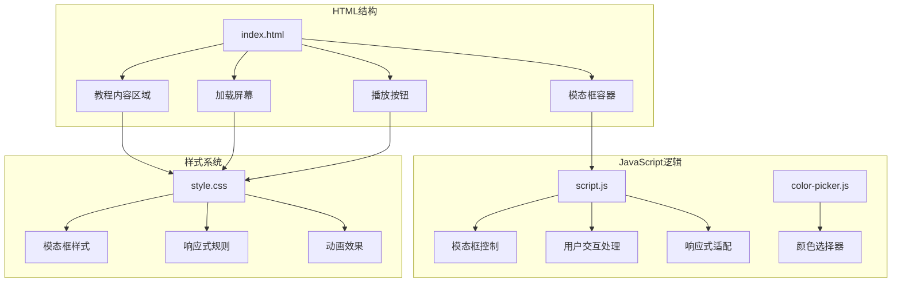

**图表来源**
- [index.html:24-39](file://index.html#L24-L39)
- [script.js:428-436](file://js/script.js#L428-L436)
- [style.css:503-575](file://styles/style.css#L503-L575)

**章节来源**
- [index.html:1-282](file://index.html#L1-L282)
- [script.js:1-1049](file://js/script.js#L1-L1049)
- [style.css:1-1571](file://styles/style.css#L1-L1571)

## 核心组件

### 模态框容器结构

模态框采用Bootstrap的标准结构，包含完整的对话框层次：

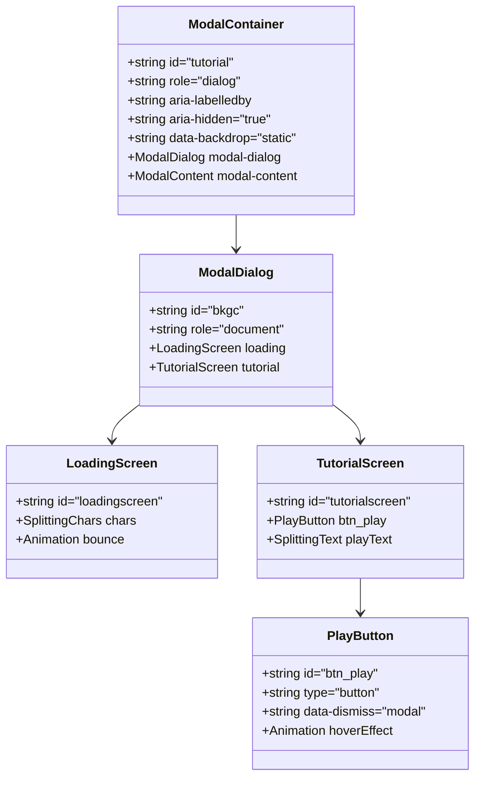

**图表来源**
- [index.html:24-39](file://index.html#L24-L39)
- [index.html:29-36](file://index.html#L29-L36)

### JavaScript控制逻辑

模态框的JavaScript控制逻辑主要集中在script.js文件中，实现了完整的生命周期管理：

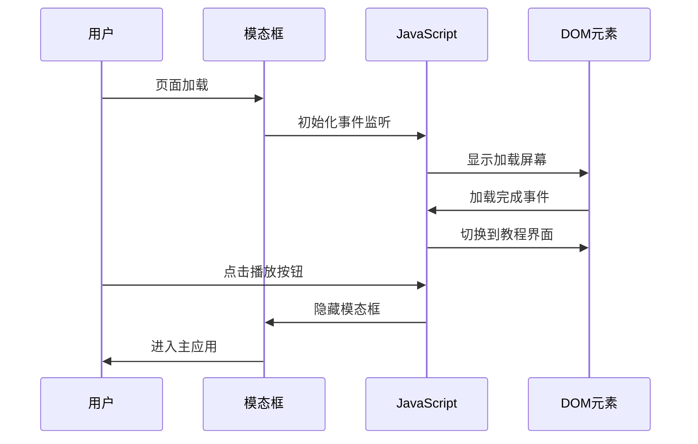

**图表来源**
- [script.js:745-770](file://js/script.js#L745-L770)
- [index.html:278](file://index.html#L278)

**章节来源**
- [script.js:428-436](file://js/script.js#L428-L436)
- [script.js:745-770](file://js/script.js#L745-L770)

## 架构概览

### 整体系统架构

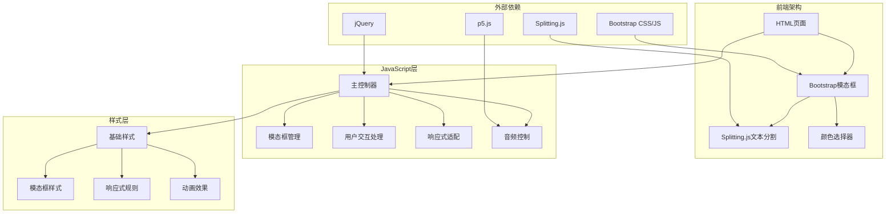

**图表来源**
- [index.html:254-261](file://index.html#L254-L261)
- [script.js:1-1049](file://js/script.js#L1-L1049)

### 数据流架构

模态框系统遵循清晰的数据流向：

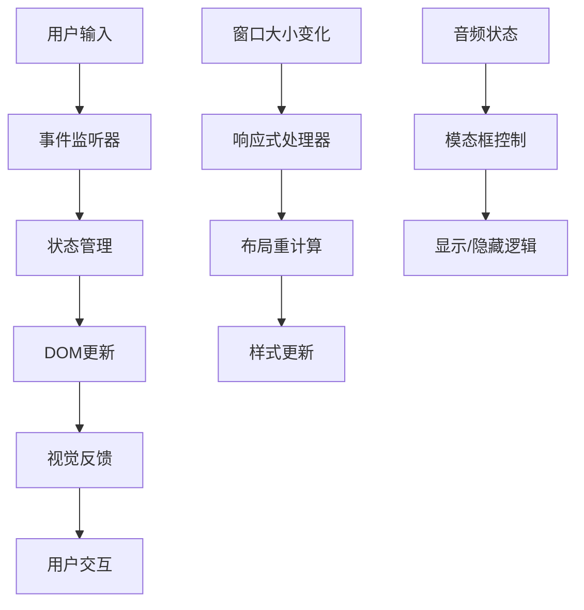

**图表来源**
- [script.js:153](file://js/script.js#L153)
- [script.js:428-436](file://js/script.js#L428-L436)

## 详细组件分析

### Bootstrap模态框初始化

模态框使用Bootstrap的标准初始化方式，确保了跨浏览器兼容性和标准行为：

#### 模态框配置选项

| 属性 | 值 | 描述 |
|------|-----|------|
| id | tutorial | 模态框唯一标识符 |
| class | modal fade | Bootstrap模态框类 |
| role | dialog | ARIA角色定义 |
| tabindex | -1 | 键盘导航支持 |
| data-backdrop | static | 背景点击行为设置 |

#### 生命周期管理

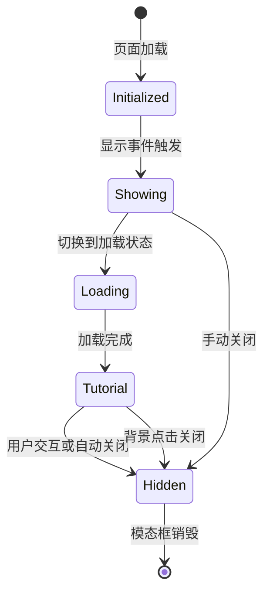

**图表来源**
- [index.html:25-39](file://index.html#L25-L39)
- [script.js:745-770](file://js/script.js#L745-L770)

**章节来源**
- [index.html:25-39](file://index.html#L25-L39)
- [script.js:745-770](file://js/script.js#L745-L770)

### 内容结构分析

#### 加载屏幕设计

加载屏幕采用Splitting.js进行字符级动画，提供了流畅的视觉过渡效果：

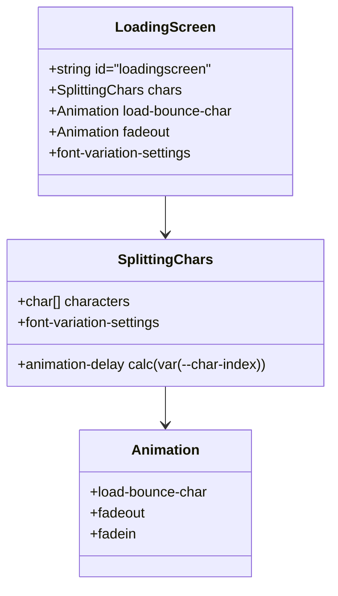

**图表来源**
- [index.html:29-31](file://index.html#L29-L31)
- [style.css:241-275](file://styles/style.css#L241-L275)

#### 教程界面布局

教程界面采用Flexbox布局，确保在不同设备上的完美适配：

| 组件 | 样式属性 | 响应式行为 |
|------|----------|------------|
| 容器 | display: flex | 在小屏幕上自动换行 |
| 文本 | text-align: center | 居中对齐 |
| 按钮 | margin: auto | 自动居中 |
| 动画 | fadein/fadeout | 平滑过渡 |

**章节来源**
- [index.html:32-36](file://index.html#L32-L36)
- [style.css:277-308](file://styles/style.css#L277-L308)

### 显示/隐藏逻辑

#### 自动启动机制

模态框在页面加载完成后自动显示，确保用户能够立即看到教程内容：

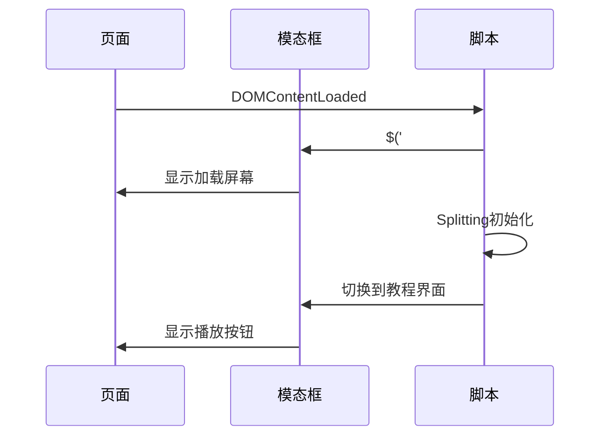

**图表来源**
- [index.html:278](file://index.html#L278)

#### 手动关闭控制

播放按钮提供明确的手动关闭机制：

| 事件类型 | 触发条件 | 行为 |
|----------|----------|------|
| click | 用户点击播放按钮 | 隐藏模态框 |
| data-dismiss | Bootstrap内置属性 | 支持ESC键关闭 |
| 手动调用 | JavaScript方法 | $('#tutorial').modal('hide') |

**章节来源**
- [index.html:33-35](file://index.html#L33-L35)
- [script.js:745-770](file://js/script.js#L745-L770)

### 响应式设计实现

#### 窗口大小适配策略

系统针对不同屏幕尺寸提供了专门的样式规则：

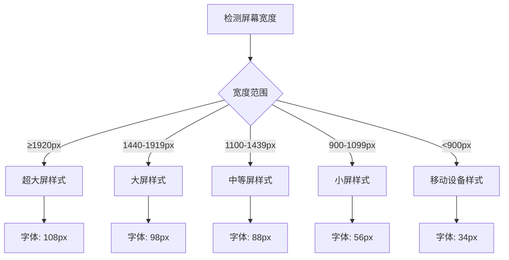

**图表来源**
- [style.css:981-1102](file://styles/style.css#L981-L1102)

#### 居中定位机制

模态框采用绝对定位和CSS Flexbox结合的方式实现完美居中：

| 定位方式 | 实现原理 | 适用场景 |
|----------|----------|----------|
| 绝对定位 | top: 0, left: 0, bottom: 0, right: 0 | 固定尺寸模态框 |
| Flexbox | display: flex, justify-content: center | 弹性内容 |
| CSS Grid | grid-template-columns: 1fr | 复杂布局 |

**章节来源**
- [style.css:562-575](file://styles/style.css#L562-L575)
- [style.css:1281-1297](file://styles/style.css#L1281-L1297)

### 状态管理系统

#### 加载状态跟踪

系统通过多个状态变量管理模态框的不同阶段：

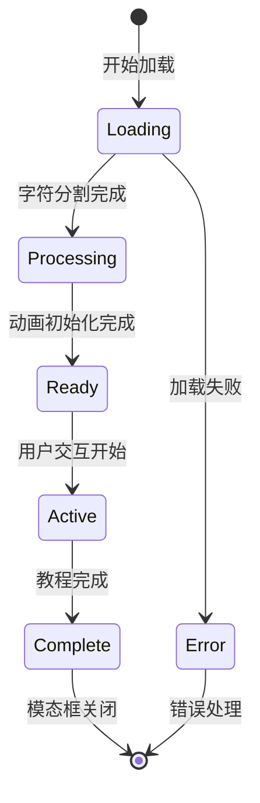

**图表来源**
- [script.js:173-201](file://js/script.js#L173-L201)

#### 用户交互反馈

系统提供了多层次的用户反馈机制：

| 反馈类型 | 实现方式 | 触发条件 |
|----------|----------|----------|
| 视觉反馈 | CSS动画 | 用户悬停/点击 |
| 听觉反馈 | 音频响应 | 音量变化 |
| 触觉反馈 | 按钮状态 | 移动端触摸 |
| 文字反馈 | 提示信息 | 状态变化 |

**章节来源**
- [script.js:428-436](file://js/script.js#L428-L436)
- [color-picker.js:95-175](file://js/color-picker.js#L95-L175)

## 依赖关系分析

### 外部库依赖

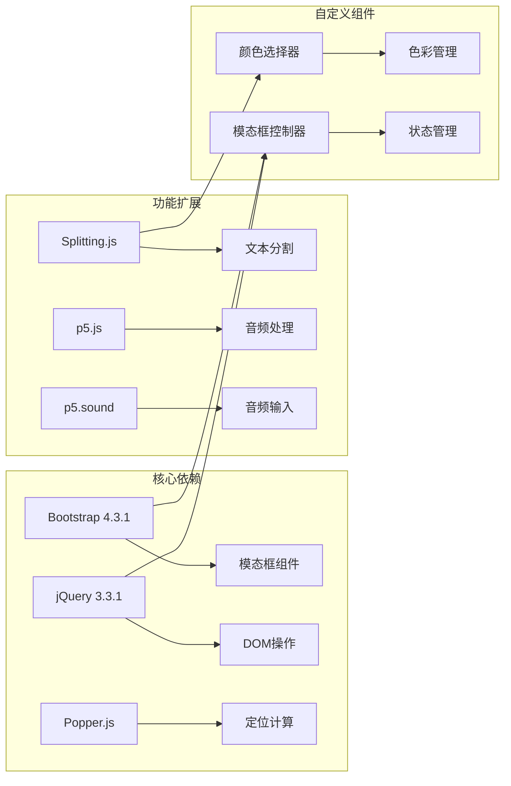

**图表来源**
- [index.html:254-261](file://index.html#L254-L261)
- [script.js:1-1049](file://js/script.js#L1-L1049)

### 内部模块耦合

模态框系统内部模块之间的依赖关系相对松散，便于维护和扩展：

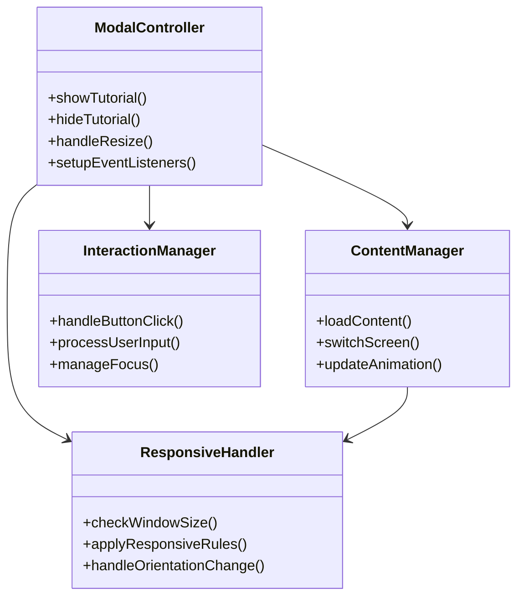

**图表来源**
- [script.js:428-436](file://js/script.js#L428-L436)
- [script.js:745-770](file://js/script.js#L745-L770)

**章节来源**
- [index.html:254-261](file://index.html#L254-L261)
- [script.js:1-1049](file://js/script.js#L1-L1049)

## 性能考虑

### 加载性能优化

系统采用了多项性能优化策略：

1. **延迟加载**: 非关键资源延迟加载
2. **CSS动画**: 使用GPU加速的CSS3动画
3. **事件节流**: 窗口大小变化事件防抖处理
4. **内存管理**: 及时清理事件监听器和定时器

### 渲染性能优化

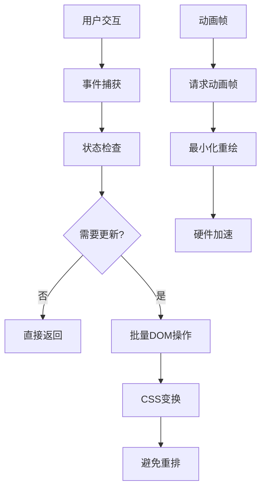

### 内存使用优化

- **对象池**: 复用DOM元素和动画对象
- **垃圾回收**: 及时移除不再使用的事件监听器
- **缓存策略**: 缓存计算结果和DOM查询结果

## 故障排除指南

### 常见问题及解决方案

#### 模态框无法显示

**症状**: 模态框初始化后不显示

**可能原因**:
1. Bootstrap CSS未正确加载
2. jQuery版本不兼容
3. 模态框ID冲突

**解决步骤**:
1. 检查网络连接和CDN可用性
2. 验证jQuery版本与Bootstrap兼容性
3. 确认模态框ID唯一性

#### 响应式样式失效

**症状**: 在移动设备上显示异常

**可能原因**:
1. viewport meta标签缺失
2. CSS媒体查询冲突
3. 样式优先级问题

**解决步骤**:
1. 添加正确的viewport meta标签
2. 检查媒体查询的顺序和条件
3. 调整CSS选择器优先级

#### 动画性能问题

**症状**: 动画卡顿或掉帧

**可能原因**:
1. 过多的DOM操作
2. 复杂的CSS选择器
3. 不必要的重排重绘

**解决步骤**:
1. 使用will-change属性提示浏览器
2. 简化CSS选择器
3. 批量更新DOM操作

**章节来源**
- [index.html:6](file://index.html#L6)
- [style.css:141-162](file://styles/style.css#L141-L162)

## 结论

该模态对话框系统展现了现代Web应用开发的最佳实践，成功地将Bootstrap框架的强大功能与自定义JavaScript逻辑相结合。系统的主要优势包括：

1. **架构清晰**: 模块化设计便于维护和扩展
2. **响应式友好**: 全面的移动端适配方案
3. **用户体验优秀**: 流畅的动画效果和直观的交互设计
4. **性能优化**: 多层次的性能优化策略

系统在教程引导、用户交互和视觉呈现方面都达到了较高的水准，为类似的应用程序提供了良好的参考模板。

## 附录

### 自定义指南

#### 修改模态框内容

要修改模态框的内容，需要编辑HTML结构并在相应的CSS中添加样式规则。

#### 调整动画效果

可以通过修改CSS动画关键帧来调整模态框的显示/隐藏效果。

#### 定制样式主题

使用CSS变量和媒体查询可以轻松实现主题切换和响应式设计。