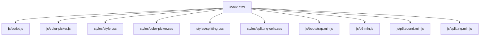
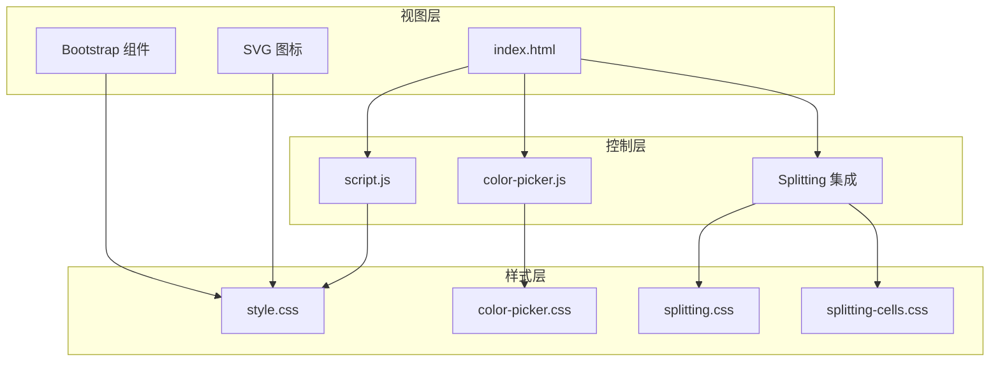
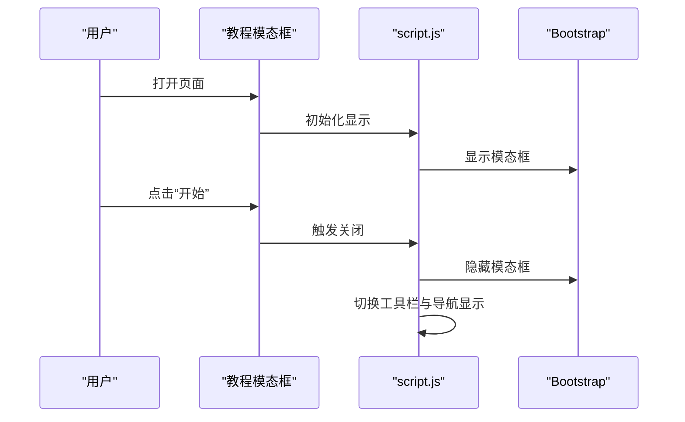
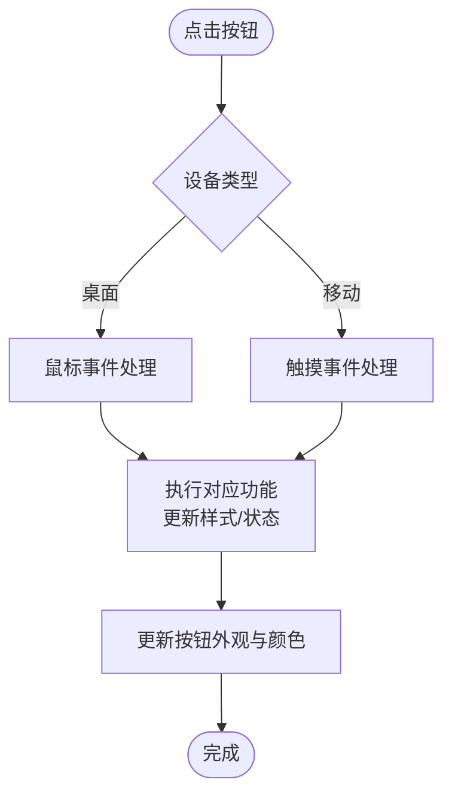
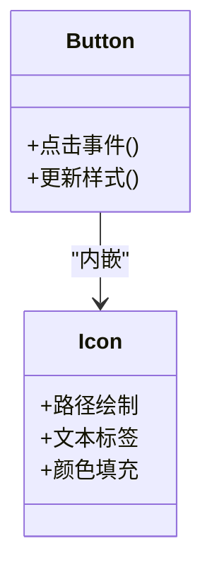
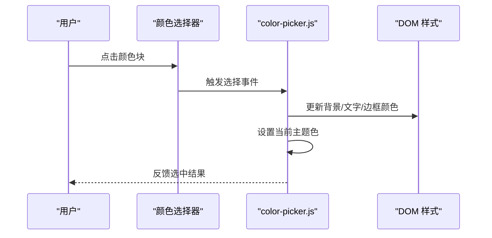
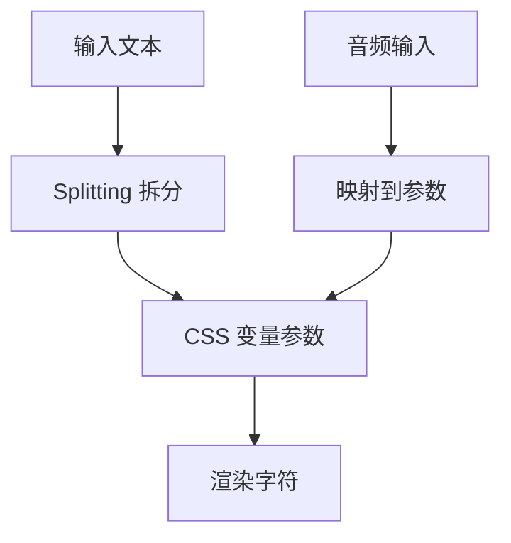
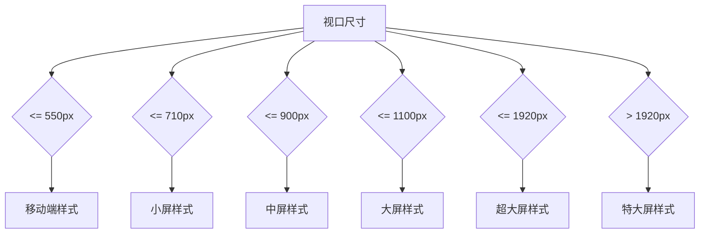
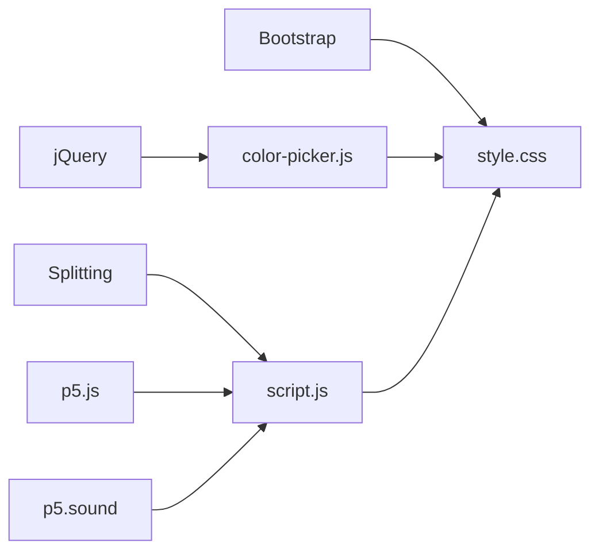

# 用户界面系统

<cite>
**本文档引用的文件**
- [index.html](file://index.html)
- [script.js](file://js/script.js)
- [style.css](file://styles/style.css)
- [color-picker.js](file://js/color-picker.js)
- [color-picker.css](file://styles/color-picker.css)
- [splitting.css](file://styles/splitting.css)
- [splitting-cells.css](file://styles/splitting-cells.css)
</cite>

## 目录
1. [简介](#简介)
2. [项目结构](#项目结构)
3. [核心组件](#核心组件)
4. [架构总览](#架构总览)
5. [详细组件分析](#详细组件分析)
6. [依赖关系分析](#依赖关系分析)
7. [性能考虑](#性能考虑)
8. [故障排除指南](#故障排除指南)
9. [结论](#结论)
10. [附录](#附录)

## 简介
本项目是一个基于 Bootstrap 框架与自定义样式的交互式用户界面系统，结合了 SVG 图标、Bootstrap 颜色选择器、响应式布局与动态文本渲染技术。系统通过模态对话框进行用户引导，工具栏提供丰富的交互控制（包括音频输入、颜色选择、文本对齐等），并通过 CSS 变量与媒体查询实现跨设备适配与主题定制。

## 项目结构
项目采用模块化组织方式：
- HTML 页面负责结构与初始资源加载
- JavaScript 负责业务逻辑、事件绑定与运行时行为
- CSS 负责样式、动画与响应式规则
- 第三方库通过 CDN 或本地引入（如 Bootstrap、Popper、Splitting）

**图表来源**
- [index.html](file://index.html)
- [script.js](file://js/script.js)
- [style.css](file://styles/style.css)
- [color-picker.js](file://js/color-picker.js)
- [color-picker.css](file://styles/color-picker.css)
- [splitting.css](file://styles/splitting.css)
- [splitting-cells.css](file://styles/splitting-cells.css)

**章节来源**
- [index.html](file://index.html)
- [style.css](file://styles/style.css)

## 核心组件
- 模态对话框系统：用于教程引导与加载过渡
- 工具栏与按钮组：提供音频控制、颜色选择、文本对齐等功能
- 颜色选择器：基于 Bootstrap 的自定义扩展
- 动态文本渲染：Splitting 库驱动的逐字符动画与字体参数控制
- 响应式布局：多断点适配桌面端与移动端

**章节来源**
- [index.html](file://index.html)
- [script.js](file://js/script.js)
- [style.css](file://styles/style.css)
- [color-picker.js](file://js/color-picker.js)
- [color-picker.css](file://styles/color-picker.css)
- [splitting.css](file://styles/splitting.css)
- [splitting-cells.css](file://styles/splitting-cells.css)

## 架构总览
系统采用“HTML 结构 + CSS 样式 + JS 行为”的分层架构：
- 视图层：HTML 定义页面结构与 SVG 图标；CSS 提供视觉样式与动画
- 控制层：JS 处理事件、状态管理与运行时行为（音频、颜色、布局）
- 数据层：通过 CSS 变量与 DOM 属性传递状态（如颜色、字体参数）

**图表来源**
- [index.html](file://index.html)
- [script.js](file://js/script.js)
- [color-picker.js](file://js/color-picker.js)
- [style.css](file://styles/style.css)
- [color-picker.css](file://styles/color-picker.css)
- [splitting.css](file://styles/splitting.css)
- [splitting-cells.css](file://styles/splitting-cells.css)

## 详细组件分析

### 模态对话框系统
- 教程模态框：在页面加载时自动显示，包含加载动画与“开始”按钮，支持静态背景与居中定位
- 引导流程：通过切换容器透明度与按钮可见性实现信息展示与隐藏
- 响应式适配：根据窗口尺寸动态调整模态框位置与显示策略

**图表来源**
- [index.html](file://index.html)
- [script.js](file://js/script.js)

**章节来源**
- [index.html](file://index.html)
- [script.js](file://js/script.js)
- [style.css](file://styles/style.css)

### 工具栏与按钮交互
- 按钮集合：包含显示/隐藏工具、音频开关、颜色选择、随机配色、文本对齐、信息显示等
- 事件绑定：区分桌面端鼠标事件与移动端触摸事件，确保交互一致性
- 状态管理：通过按钮类名与内联样式同步当前主题色与激活状态

**图表来源**
- [script.js](file://js/script.js)
- [style.css](file://styles/style.css)

**章节来源**
- [script.js](file://js/script.js)
- [style.css](file://styles/style.css)

### SVG 图标系统
- 图标来源：工具栏按钮内嵌 SVG，使用路径与文本元素构建统一风格
- 交互反馈：通过填充色与边框色随主题变化，保持视觉一致性
- 性能优化：SVG 内联减少请求次数，配合 CSS 过渡提升流畅度

**图表来源**
- [index.html](file://index.html)
- [style.css](file://styles/style.css)

**章节来源**
- [index.html](file://index.html)
- [style.css](file://styles/style.css)

### 颜色选择器集成
- 集成方式：基于 Bootstrap 颜色选择器的自定义扩展，提供预设颜色列表与自定义颜色支持
- 主题应用：根据选择的颜色更新全局样式变量与组件外观
- 交互细节：支持激活态指示、禁用态与尺寸变体（小/大）

**图表来源**
- [color-picker.js](file://js/color-picker.js)
- [color-picker.css](file://styles/color-picker.css)
- [style.css](file://styles/style.css)

**章节来源**
- [color-picker.js](file://js/color-picker.js)
- [color-picker.css](file://styles/color-picker.css)
- [style.css](file://styles/style.css)

### 动态文本渲染与字体参数
- 文本拆分：使用 Splitting 库将输入文本逐字符拆分，便于逐字动画与参数控制
- 字体参数：通过 CSS 变量控制可变字体参数（高度、倾斜、粗细等）
- 音频驱动：基于 p5.js 与 p5.sound 的音频输入，将音量与频谱映射到字符动画

**图表来源**
- [script.js](file://js/script.js)
- [splitting.css](file://styles/splitting.css)
- [splitting-cells.css](file://styles/splitting-cells.css)

**章节来源**
- [script.js](file://js/script.js)
- [splitting.css](file://styles/splitting.css)
- [splitting-cells.css](file://styles/splitting-cells.css)

### 响应式设计策略
- 断点规划：针对不同屏幕宽度与方向设置专用样式（如 710px、900px、1100px、1440px、1920px、2560px）
- 移动端适配：隐藏部分 UI 元素、调整按钮尺寸与位置、简化导航与工具栏
- 触摸交互：在移动设备上使用触摸事件替代鼠标事件，优化滚动与点击体验

**图表来源**
- [style.css](file://styles/style.css)

**章节来源**
- [style.css](file://styles/style.css)

## 依赖关系分析
- 外部依赖：Bootstrap、Popper、Splitting、p5.js、p5.sound
- 内部依赖：脚本按顺序加载，颜色选择器依赖 jQuery，动态文本依赖 Splitting
- 样式依赖：颜色选择器样式与主样式协同工作，响应式样式按断点生效

**图表来源**
- [index.html](file://index.html)
- [script.js](file://js/script.js)
- [color-picker.js](file://js/color-picker.js)
- [style.css](file://styles/style.css)

**章节来源**
- [index.html](file://index.html)
- [script.js](file://js/script.js)
- [color-picker.js](file://js/color-picker.js)
- [style.css](file://styles/style.css)

## 性能考虑
- 渲染优化：使用 CSS 变量与 transform 缩放减少重排；在移动设备上降低动画复杂度
- 资源加载：SVG 内联与样式合并减少请求数；媒体查询按需应用
- 事件节流：滑条与触摸事件在移动设备上进行状态判断，避免频繁重绘
- 音频处理：平滑参数与频谱计算在 draw 循环中进行，避免阻塞主线程

[本节为通用指导，无需特定文件来源]

## 故障排除指南
- 模态框不显示或无法关闭：检查模态框初始化与 Bootstrap 版本兼容性
- 颜色选择器无响应：确认 jQuery 加载顺序与颜色选择器脚本加载时机
- 文本不渲染或动画异常：验证 Splitting 初始化与目标元素存在性
- 移动端触摸无效：检查触摸事件绑定与 isMobile 判断逻辑
- 音频权限问题：在 Safari 等浏览器中注意自动播放限制与用户手势要求

**章节来源**
- [script.js](file://js/script.js)
- [color-picker.js](file://js/color-picker.js)
- [style.css](file://styles/style.css)

## 结论
该用户界面系统通过 Bootstrap 的组件能力与自定义扩展，实现了从工具栏到颜色选择器再到动态文本渲染的完整交互链路。借助 Splitting 与 CSS 变量，系统在桌面与移动端均提供了流畅的视觉体验与良好的可维护性。建议后续进一步封装组件接口、增加无障碍支持与国际化能力。

[本节为总结，无需特定文件来源]

## 附录

### 使用指南与定制方法
- CSS 类命名规范
  - 工具栏与按钮：使用语义化前缀（如 menu、btn_）并遵循 BEM 风格
  - 颜色选择器：使用 color-picker-wrap 作为容器，子元素按功能划分
  - 动态文本：使用 splitting 作为根类，子元素按字符与单词划分
- 样式覆盖策略
  - 通过 CSS 变量（如 --SliderColor）进行主题级覆盖
  - 在媒体查询中针对断点进行局部覆盖，避免全局污染
  - 使用 !important 仅限于必要场景，优先使用选择器特异性
- 主题定制选项
  - 颜色：通过 color-picker.js 中的颜色列表与当前主题色变量进行切换
  - 字体：通过 CSS 变量控制可变字体参数，实现动态效果
  - 布局：通过媒体查询与 Flexbox/Grid 调整工具栏与导航位置

**章节来源**
- [style.css](file://styles/style.css)
- [color-picker.js](file://js/color-picker.js)
- [splitting.css](file://styles/splitting.css)

### 最佳实践建议
- 将第三方库版本固定，避免升级导致的样式或行为差异
- 在移动设备上优先使用触摸事件，桌面端保留鼠标事件
- 对动画与重绘进行节流，避免在高频事件中直接操作 DOM
- 使用 CSS 变量集中管理主题色，便于快速切换与扩展
- 为关键交互添加无障碍属性（如 aria-label、role），提升可用性

[本节为通用指导，无需特定文件来源]