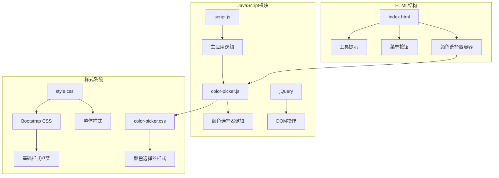
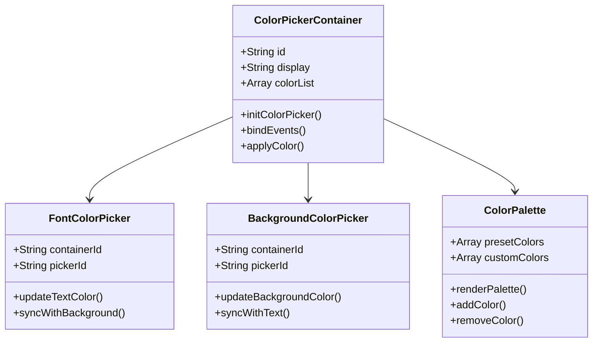
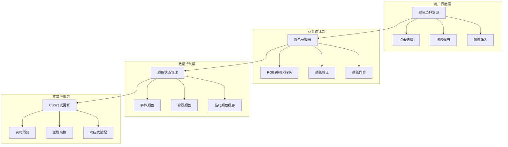
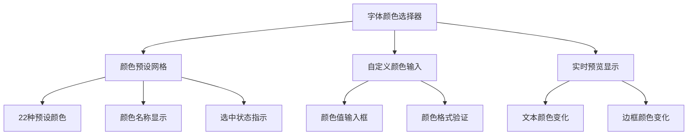
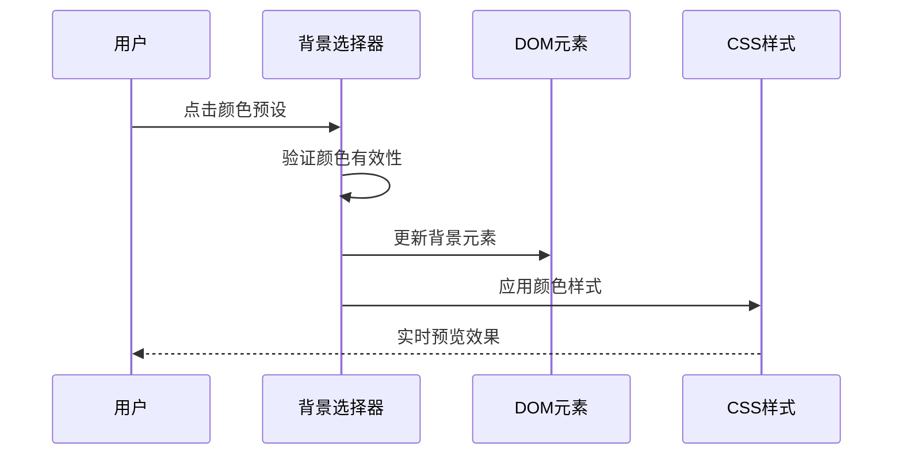
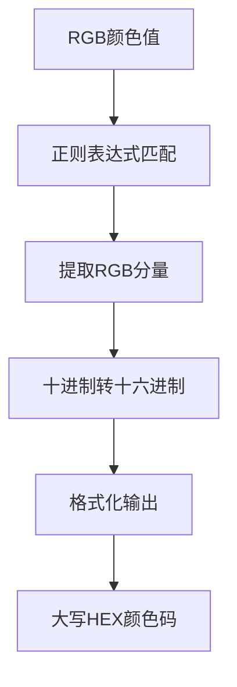
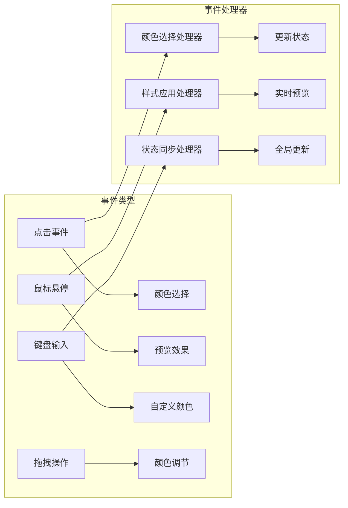
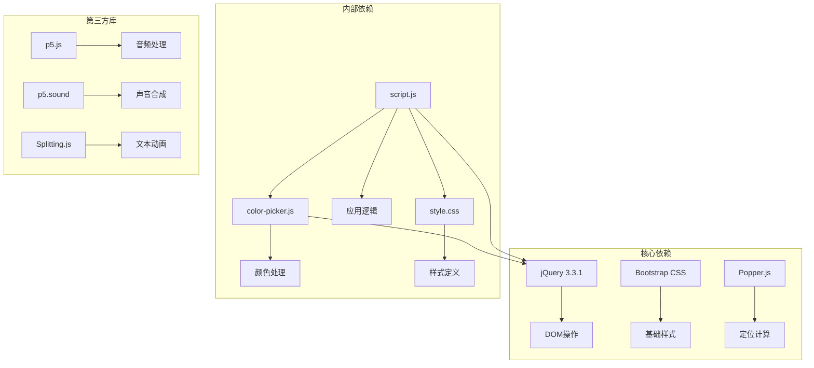
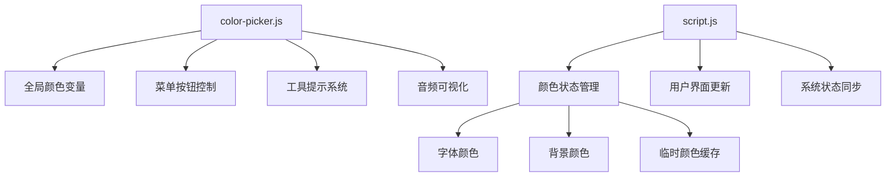

# 颜色选择器集成

<cite>
**本文档引用的文件**
- [index.html](file://index.html)
- [color-picker.js](file://js/color-picker.js)
- [color-picker.css](file://styles/color-picker.css)
- [script.js](file://js/script.js)
- [style.css](file://styles/style.css)
</cite>

## 目录
1. [简介](#简介)
2. [项目结构](#项目结构)
3. [核心组件](#核心组件)
4. [架构概览](#架构概览)
5. [详细组件分析](#详细组件分析)
6. [依赖关系分析](#依赖关系分析)
7. [性能考虑](#性能考虑)
8. [故障排除指南](#故障排除指南)
9. [结论](#结论)
10. [附录](#附录)

## 简介

本项目实现了基于Bootstrap的颜色选择器集成，为SYMPHOSIZER打字器应用提供了完整的颜色管理系统。该颜色选择器集成了字体颜色选择器和背景颜色选择器，支持颜色预设、自定义颜色输入和实时预览功能。

颜色选择器采用响应式设计，支持桌面端和移动端的不同交互方式，包括点击选择、拖拽调节和键盘输入支持。系统通过CSS变量和JavaScript动态更新实现了颜色的实时应用。

## 项目结构

项目采用模块化架构，主要包含以下文件结构：



**图表来源**
- [index.html:240-248](file://index.html#L240-L248)
- [color-picker.js:1-231](file://js/color-picker.js#L1-L231)
- [style.css:423-426](file://styles/style.css#L423-L426)

**章节来源**
- [index.html:1-282](file://index.html#L1-L282)
- [color-picker.js:1-231](file://js/color-picker.js#L1-L231)
- [style.css:1-1571](file://styles/style.css#L1-L1571)

## 核心组件

### 颜色选择器容器

颜色选择器由两个独立的容器组成，分别用于字体颜色和背景颜色的选择：



**图表来源**
- [index.html:241-247](file://index.html#L241-L247)
- [color-picker.js:4-27](file://js/color-picker.js#L4-L27)

### 颜色预设系统

系统内置了22种精心挑选的颜色预设，涵盖了从经典黑白到丰富的彩色方案：

| 预设类别 | 颜色数量 | 示例颜色 |
|---------|---------|----------|
| 经典预设 | 2 | 白色(#FFFFFF)、黑色(#000000) |
| 自然色调 | 8 | 米色、棕色、绿色等 |
| 暖色调 | 6 | 橙色、红色、粉色等 |
| 冷色调 | 6 | 蓝色、青色、紫色等 |

**章节来源**
- [color-picker.js:4-27](file://js/color-picker.js#L4-L27)

## 架构概览

颜色选择器采用分层架构设计，确保了良好的可维护性和扩展性：



**图表来源**
- [color-picker.js:95-175](file://js/color-picker.js#L95-L175)
- [color-picker.js:177-211](file://js/color-picker.js#L177-L211)

### 初始化流程

颜色选择器的初始化过程包括以下关键步骤：

1. **DOM准备检查**：等待页面完全加载后初始化颜色选择器
2. **颜色预设渲染**：根据预设数组生成颜色选择列表
3. **事件绑定**：为颜色选择器绑定点击、变更等事件处理器
4. **状态同步**：确保当前选中的颜色与界面状态保持一致

**章节来源**
- [color-picker.js:3-93](file://js/color-picker.js#L3-L93)

## 详细组件分析

### 颜色选择器界面设计

#### 字体颜色选择器

字体颜色选择器位于右侧菜单区域，采用简洁的圆形设计：



**图表来源**
- [index.html:242-244](file://index.html#L242-L244)
- [color-picker.css:11-47](file://styles/color-picker.css#L11-L47)

#### 背景颜色选择器

背景颜色选择器位于左侧菜单区域，设计风格与字体选择器相呼应：



**图表来源**
- [index.html:245-247](file://index.html#L245-L247)
- [color-picker.js:108-122](file://js/color-picker.js#L108-L122)

**章节来源**
- [color-picker.css:71-93](file://styles/color-picker.css#L71-L93)

### 颜色处理算法

#### RGB到HEX转换

颜色选择器实现了高效的RGB到HEX颜色格式转换：



**图表来源**
- [color-picker.js:217-229](file://js/color-picker.js#L217-L229)

#### 颜色验证机制

系统内置了多重颜色验证机制，确保颜色值的有效性：

1. **格式验证**：检查颜色值是否符合HEX格式
2. **范围验证**：验证RGB分量在有效范围内
3. **兼容性验证**：确保颜色在不同浏览器中的兼容性

**章节来源**
- [color-picker.js:213-229](file://js/color-picker.js#L213-L229)

### 事件绑定系统

颜色选择器采用事件驱动的设计模式，支持多种用户交互方式：



**图表来源**
- [color-picker.js:95-175](file://js/color-picker.js#L95-L175)

**章节来源**
- [color-picker.js:95-211](file://js/color-picker.js#L95-L211)

## 依赖关系分析

### 外部依赖

颜色选择器系统依赖于以下外部库和框架：



**图表来源**
- [index.html:254-261](file://index.html#L254-L261)
- [script.js:1-1049](file://js/script.js#L1-L1049)

### 内部模块依赖

颜色选择器与其他系统模块的集成关系：



**图表来源**
- [script.js:20-22](file://js/script.js#L20-L22)
- [script.js:596-660](file://js/script.js#L596-L660)

**章节来源**
- [color-picker.js:1-2](file://js/color-picker.js#L1-L2)
- [script.js:596-660](file://js/script.js#L596-L660)

## 性能考虑

### 渲染优化

颜色选择器采用了多项性能优化策略：

1. **事件委托**：使用事件委托减少事件监听器数量
2. **虚拟DOM**：通过CSS类名切换而非直接DOM操作
3. **延迟加载**：颜色选择器仅在需要时显示
4. **内存管理**：及时清理事件监听器和DOM引用

### 响应式设计

系统针对不同设备进行了专门的性能优化：

- **桌面端**：支持鼠标悬停预览和快速点击选择
- **移动端**：优化触摸交互和手势识别
- **平板设备**：自适应布局和缩放处理

## 故障排除指南

### 常见问题及解决方案

#### 颜色选择器不显示

**症状**：颜色选择器容器为空白或不可见

**可能原因**：
1. jQuery未正确加载
2. DOM元素未找到
3. CSS样式冲突

**解决方法**：
1. 检查jQuery版本兼容性
2. 确认DOM元素ID正确
3. 检查CSS优先级冲突

#### 颜色无法应用

**症状**：选择颜色后界面无变化

**可能原因**：
1. 颜色格式不正确
2. CSS选择器失效
3. JavaScript错误

**解决方法**：
1. 验证颜色值格式（#RRGGBB）
2. 检查目标元素是否存在
3. 查看浏览器控制台错误信息

#### 事件绑定失败

**症状**：点击颜色无反应

**可能原因**：
1. 事件委托未正确设置
2. 事件冒泡被阻止
3. 元素被其他层遮挡

**解决方法**：
1. 确认事件委托选择器正确
2. 检查CSS z-index层级
3. 验证元素可见性

**章节来源**
- [color-picker.js:95-175](file://js/color-picker.js#L95-L175)

## 结论

本颜色选择器集成项目成功实现了完整的颜色管理系统，具有以下特点：

1. **高度集成性**：与主应用无缝集成，支持实时颜色预览
2. **用户友好性**：提供直观的交互方式和响应式设计
3. **可扩展性**：模块化设计便于功能扩展和定制
4. **性能优化**：采用多项优化策略确保流畅的用户体验

通过合理的架构设计和完善的错误处理机制，该颜色选择器为SYMPHOSIZER应用提供了稳定可靠的颜色管理功能。

## 附录

### API参考

#### 颜色选择器配置选项

| 选项名称 | 类型 | 默认值 | 描述 |
|---------|------|--------|------|
| `cp-sm` | class | - | 小尺寸颜色选择器 |
| `cp-lg` | class | - | 大尺寸颜色选择器 |
| `cp-show` | class | - | 显示选中颜色信息 |

#### 主要函数

| 函数名称 | 参数 | 返回值 | 描述 |
|---------|------|--------|------|
| `rgb2hex` | String | String | RGB颜色转HEX格式 |
| `hex` | Number | String | 十进制转十六进制 |
| `swapColor` | Element | void | 切换按钮颜色状态 |

### 使用示例

#### 基本使用

```javascript
// 初始化颜色选择器
$(document).ready(function() {
    // 颜色选择器会自动初始化
});

// 获取当前颜色
var currentColor = colorFont; // 字体颜色
var backgroundColor = colorBG; // 背景颜色
```

#### 自定义颜色方案

```javascript
// 添加自定义颜色预设
var customColors = [
    { color: '#FF6B6B' },
    { color: '#4ECDC4' },
    { color: '#45B7D1' }
];

// 替换默认颜色列表
$color_list = customColors;
```