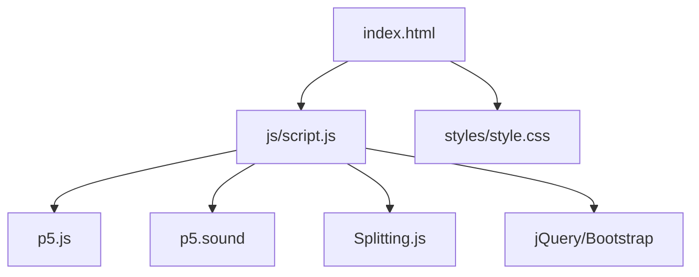
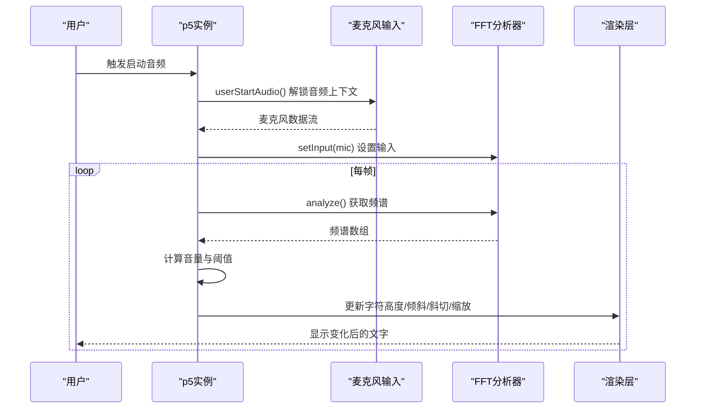
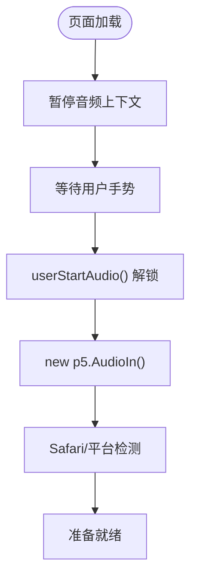
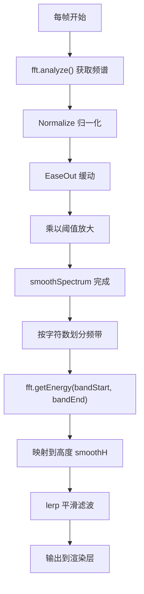
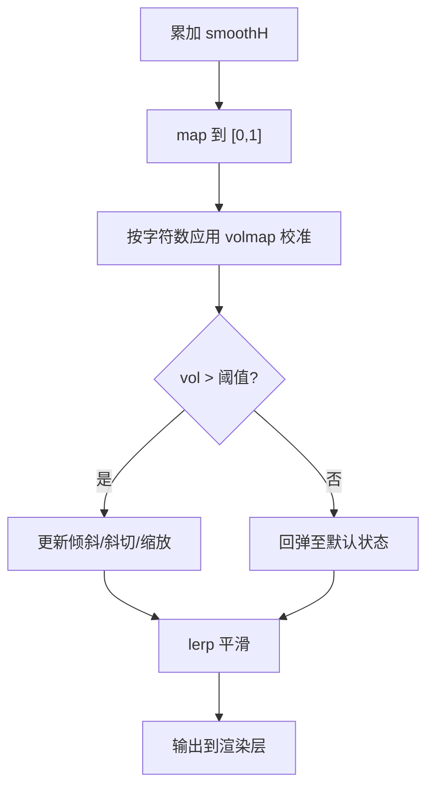
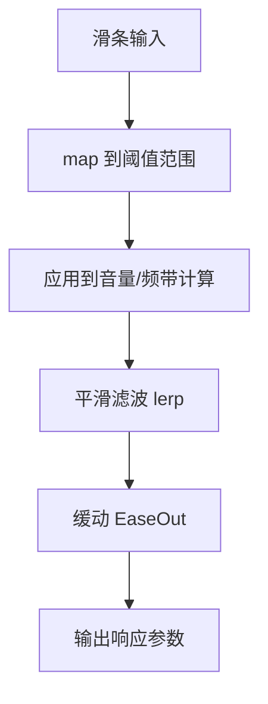
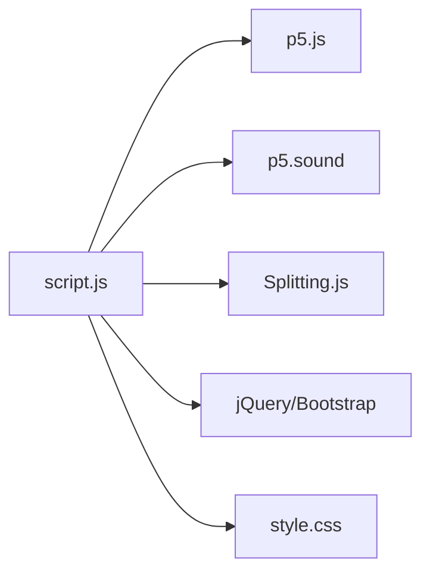

# 音频处理系统

<cite>
**本文引用的文件**
- [index.html](file://index.html)
- [script.js](file://js/script.js)
- [style.css](file://styles/style.css)
</cite>

## 目录
1. [简介](#简介)
2. [项目结构](#项目结构)
3. [核心组件](#核心组件)
4. [架构总览](#架构总览)
5. [详细组件分析](#详细组件分析)
6. [依赖关系分析](#依赖关系分析)
7. [性能考量](#性能考量)
8. [故障排查指南](#故障排查指南)
9. [结论](#结论)
10. [附录](#附录)

## 简介
本项目是一个基于浏览器的“声音激活型排版乐器”，通过麦克风采集音频，结合 p5.js 的 Web Audio API 能力进行频域分析与实时可视化，将声音强度映射到字体的形态变化（如高度、倾斜、斜切、缩放等），实现“以声控字”的交互体验。系统同时支持鼠标交互作为替代输入方式，并提供灵敏度调节滑条与颜色主题切换等工具。

## 项目结构
- 前端页面入口：index.html
- 核心逻辑与音频处理：js/script.js
- 样式与布局：styles/style.css
- 外部依赖：p5.js、p5.sound、jQuery、Bootstrap、Splitting.js 等

图表来源
- [index.html](file://index.html)
- [script.js](file://js/script.js)

章节来源
- [index.html](file://index.html)
- [script.js](file://js/script.js)
- [style.css](file://styles/style.css)

## 核心组件
- 麦克风输入与音频上下文
  - 使用 p5.AudioIn 初始化麦克风输入，配合 userStartAudio() 触发浏览器音频上下文解锁。
  - 在移动端与桌面端分别设置不同的初始灵敏度阈值，适配不同设备的输入特性。
- FFT 频谱分析
  - 使用 p5.FFT 进行快速傅里叶变换，获取频域幅度谱；随后对频带能量进行归一化与平滑处理。
- 实时体积检测与响应
  - 将各字符所在频带的能量累加为总体音量，结合字符数量进行校准映射，驱动字体的倾斜、斜切与缩放。
- 音频响应参数实时计算
  - 平滑滤波（lerp）、缓动函数（EaseIn/EaseOut）、阈值判断与动态范围映射，形成自然的响应曲线。
- 用户交互与灵敏度控制
  - 提供麦克风灵敏度滑条，支持在运行时动态调整阈值；移动端与桌面端阈值范围不同。
- 字体渲染与动画
  - 利用 CSS 变体轴（如 vrsb、YTUC、ital）与 transform（skew、scale）实现字符高度、倾斜、斜切与缩放的实时变化。

章节来源
- [script.js](file://js/script.js)

## 架构总览
系统采用“事件驱动 + 实时渲染”的架构：
- 初始化阶段：加载资源、创建 p5 实例、暂停音频上下文、隐藏工具栏。
- 启动阶段：用户手势触发音频上下文解锁，启动麦克风与 FFT，进入主循环。
- 主循环：每帧根据当前音量与频谱，更新字符高度、倾斜、斜切与缩放，渲染到页面。

图表来源
- [script.js](file://js/script.js)

## 详细组件分析

### 麦克风音频输入与初始化
- 音频上下文与权限
  - 页面加载时通过 p5 的 getAudioContext() 暂停音频上下文，等待用户手势触发 userStartAudio() 解锁。
  - 初始化 p5.AudioIn() 创建麦克风输入对象。
- 设备检测与平台适配
  - 通过正则与 Safari 特性检测区分 Safari 浏览器，避免兼容性问题。
- 移动端与桌面端差异
  - 不同平台设置不同的初始灵敏度阈值，保证在不同设备上的可用性。

图表来源
- [script.js](file://js/script.js)

章节来源
- [script.js](file://js/script.js)

### FFT 频谱分析与能量提取
- FFT 初始化
  - 使用 p5.FFT(α, N)，其中 α 为时间窗口权重，N 为频谱长度（此处为 1024）。
  - 将麦克风输入设置为 FFT 输入源。
- 能量计算与归一化
  - 每帧调用 fft.analyze() 获取频谱数组；
  - 对每个频点进行归一化处理；
  - 应用 EaseOut 缓动与阈值放大，得到平滑的频谱响应 smoothSpectrum。
- 频带能量提取
  - 通过 fft.getEnergy(bandStart, bandEnd) 获取指定频带的能量值；
  - 将能量映射到字符高度 smoothH，并加入平滑滤波。

图表来源
- [script.js](file://js/script.js)

章节来源
- [script.js](file://js/script.js)

### 音量检测与阈值判断
- 总体音量计算
  - 将所有字符对应的 smoothH 累加，再通过 map 映射到 [0,1] 区间，得到总体音量 vol。
- 字符数量校准
  - 根据字符数量 charnum 设置 volmap 校准系数，避免字符越多越“响”的视觉偏差。
- 阈值判断与响应
  - 当 vol 超过不同阈值时，分别驱动倾斜 smoothI、斜切 smoothSkew 与缩放 loudSize 的变化。
  - 使用 lerp 实现平滑过渡，EaseOut 提升响应的自然感。

图表来源
- [script.js](file://js/script.js)

章节来源
- [script.js](file://js/script.js)

### 音频响应参数实时计算
- 平滑滤波
  - 使用 lerp(smooth, target, amount) 对平滑参数进行插值，避免突变。
- 动态范围映射
  - map 函数将原始能量或音量映射到合适的显示范围，确保视觉一致性。
- 用户可调灵敏度
  - 通过滑条 micSlider 将 [0,100] 映射到不同阈值区间，移动端与桌面端范围不同，保证跨设备体验一致。

图表来源
- [script.js](file://js/script.js)

章节来源
- [script.js](file://js/script.js)

### 字体渲染与动画
- 字体属性映射
  - 通过 CSS 变体轴（如 vrsb、YTUC、ital）与 transform（skew、scale）实现字符高度、倾斜、斜切与缩放。
- 文本拆分与逐字控制
  - 使用 Splitting.js 将文本拆分为字符级元素，逐个应用响应参数。
- 动画与过渡
  - 结合 CSS 动画与 JavaScript 插值，实现平滑的视觉过渡。

章节来源
- [script.js](file://js/script.js)
- [style.css](file://styles/style.css)

## 依赖关系分析
- p5.js 与 p5.sound
  - p5.js 提供图形与动画框架；p5.sound 提供 Web Audio API 的高级封装（AudioIn、FFT、getEnergy 等）。
- Splitting.js
  - 将文本拆分为字符级 DOM 元素，便于逐字控制。
- jQuery/Bootstrap
  - 提供 UI 组件与交互（模态框、按钮、菜单等）。
- 样式系统
  - style.css 定义了字体、颜色、动画与布局，支撑整体视觉表现。

图表来源
- [script.js](file://js/script.js)
- [style.css](file://styles/style.css)

章节来源
- [script.js](file://js/script.js)
- [style.css](file://styles/style.css)

## 性能考量
- 采样率与频谱长度
  - FFT 长度为 1024，属于中等分辨率，兼顾实时性与精度。若目标为更高分辨率，可考虑增大长度，但会增加 CPU 占用。
- 平滑与缓动
  - 使用 lerp 与 EaseOut 控制响应曲线，减少视觉跳变，提升流畅度。
- 频带划分与映射
  - 按字符数量动态划分频带，避免固定频带导致的不均衡响应；映射到高度时加入偏移与缩放，增强可感知性。
- 内存管理
  - 预分配 smoothSpectrum 与 smoothH 数组，避免每帧重复创建对象；及时清理不必要的 DOM 引用。
- CPU 使用优化
  - 仅在启用麦克风时进行 FFT 分析；关闭工具栏与非必要动画可降低开销；移动端与桌面端阈值不同，避免过度敏感导致频繁重绘。
- 浏览器兼容性
  - Safari 特性检测与 userStartAudio() 触发，避免音频上下文未解锁导致的异常。

章节来源
- [script.js](file://js/script.js)

## 故障排查指南
- 麦克风无法启动
  - 确认已通过用户手势触发 userStartAudio()；检查浏览器权限与 HTTPS 环境。
- 音频无响应或响应迟滞
  - 检查是否正确设置 fft.setInput(mic)；确认帧率稳定（frameRate 60）；适当提高阈值或降低频带数量。
- 频谱显示异常
  - 确认 FFT 初始化参数（α 与 N）合理；检查频带起止范围是否越界；确保 Normalize 与映射范围一致。
- 移动端体验差
  - 调整移动端初始阈值与滑条范围；减少复杂动画与重绘；优先使用触摸事件而非鼠标事件。
- 渲染卡顿
  - 限制同时渲染的字符数量；减少 CSS 变体轴的频繁修改；合并动画与过渡。

章节来源
- [script.js](file://js/script.js)

## 结论
该系统通过 p5.js 与 Web Audio API 的结合，实现了从麦克风输入到字体可视化的完整链路。其核心在于：
- 稳健的初始化与权限处理（userStartAudio）
- 基于 FFT 的频谱分析与能量提取
- 面向字符的频带划分与能量映射
- 平滑滤波与阈值判断构成的响应系统
- 可调灵敏度与跨平台适配

通过合理的参数调优与性能优化，可在多种设备上获得流畅且富有表现力的“声音控字”体验。

## 附录
- 关键实现路径参考
  - 麦克风初始化与启动：[script.js](file://js/script.js)
  - FFT 初始化与输入设置：[script.js](file://js/script.js)
  - 频谱分析与能量映射：[script.js](file://js/script.js)
  - 音量检测与阈值判断：[script.js](file://js/script.js)
  - 灵敏度滑条与阈值映射：[script.js](file://js/script.js)
  - 字体渲染与动画：[script.js](file://js/script.js)、[style.css](file://styles/style.css)