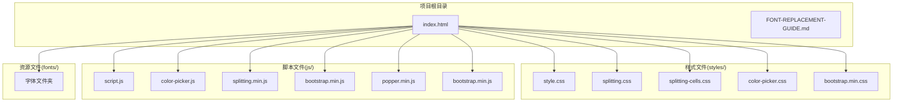
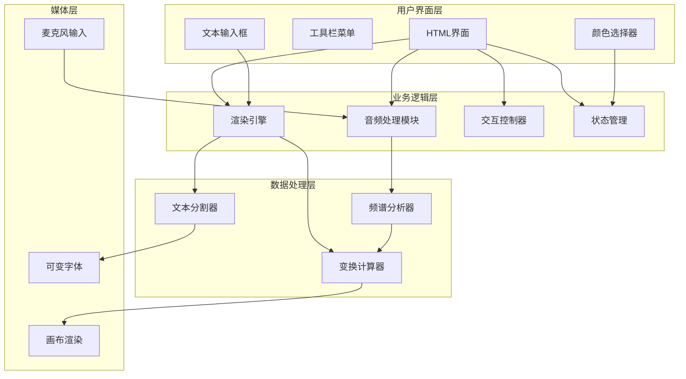
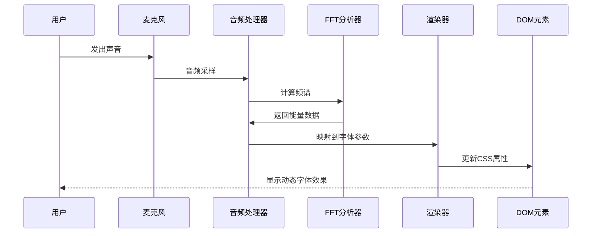
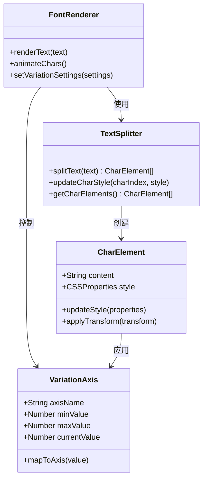
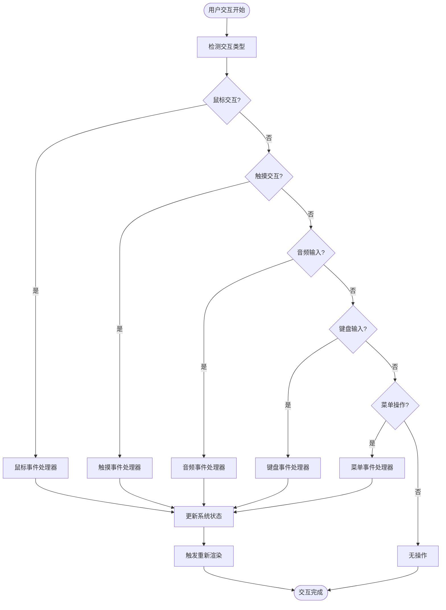
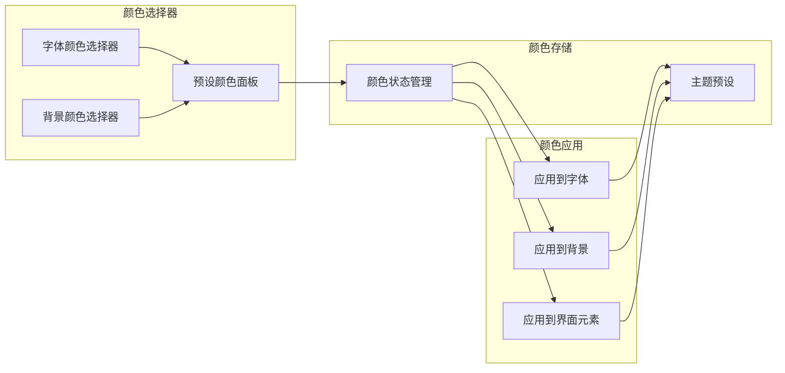
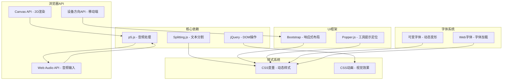

# 项目概述

<cite>
**本文档引用的文件**
- [index.html](file://index.html)
- [script.js](file://js/script.js)
- [style.css](file://styles/style.css)
- [color-picker.js](file://js/color-picker.js)
- [splitting.css](file://styles/splitting.css)
- [splitting-cells.css](file://styles/splitting-cells.css)
- [color-picker.css](file://styles/color-picker.css)
- [bootstrap.min.css](file://styles/bootstrap.min.css)
- [FONT-REPLACEMENT-GUIDE.md](file://FONT-REPLACEMENT-GUIDE.md)
</cite>

## 目录
1. [引言](#引言)
2. [项目结构](#项目结构)
3. [核心组件](#核心组件)
4. [架构总览](#架构总览)
5. [详细组件分析](#详细组件分析)
6. [依赖关系分析](#依赖关系分析)
7. [性能考虑](#性能考虑)
8. [故障排除指南](#故障排除指南)
9. [结论](#结论)
10. [附录](#附录)

## 引言

MySymphosizer是一个声音驱动的动态排版系统，它将音频输入与可变字体技术相结合，创造出随声音波动而实时变化的视觉字体艺术。该项目的核心价值在于提供一个交互式的字体艺术平台，让使用者通过声音、鼠标或触摸操作来操控字体的形态变化，实现从静态文本到动态视觉表现的转变。

该项目的独特定位体现在以下几个方面：
- **声音驱动的交互体验**：通过麦克风输入实时驱动字体变形，创造独特的听觉与视觉结合的艺术形式
- **可变字体技术应用**：利用可变字体的多轴参数控制，实现复杂的字体变形效果
- **跨平台兼容性**：支持桌面端和移动端的多种交互方式
- **艺术创作工具**：为艺术家、设计师、音乐家和创意开发者提供全新的创作媒介

## 项目结构

MySymphosizer采用简洁而清晰的文件组织结构，主要分为以下几个层次：

**图表来源**
- [index.html](file://index.html)
- [style.css](file://styles/style.css)
- [script.js](file://js/script.js)

**章节来源**
- [index.html:1-282](file://index.html#L1-L282)
- [style.css:1-1571](file://styles/style.css#L1-L1571)

## 核心组件

MySymphosizer系统由多个相互协作的核心组件构成，每个组件都承担着特定的功能职责：

### 音频处理引擎
系统集成了基于p5.js的音频处理能力，通过AudioIn接口捕获麦克风输入，并使用FFT分析频谱数据。该组件负责：
- 实时音频采样和分析
- 频率能量计算和归一化
- 音量阈值管理和音频校准
- 与字体变形参数的映射关系

### 字体分割与渲染引擎
基于Splitting.js的文本分割技术，将输入的文本分解为独立的字符元素，实现精细化的逐字符控制：
- 字符级DOM元素创建和管理
- CSS变量支持的动态属性控制
- 逐字符的变换矩阵计算
- 动画状态的平滑过渡

### 交互控制系统
提供丰富的用户交互方式，包括：
- 鼠标/触摸事件处理
- 键盘快捷键支持
- 颜色选择器集成
- 工具栏菜单管理
- 响应式布局适配

### 视觉样式系统
采用模块化的CSS架构，支持：
- 可变字体的多轴参数控制
- CSS动画和过渡效果
- 响应式设计和移动端优化
- 主题色彩系统

**章节来源**
- [script.js:1-1049](file://js/script.js#L1-L1049)
- [style.css:1-1571](file://styles/style.css#L1-L1571)

## 架构总览

MySymphosizer采用了分层架构设计，确保各组件之间的松耦合和高内聚：

**图表来源**
- [index.html](file://index.html)
- [script.js](file://js/script.js)
- [style.css](file://styles/style.css)

该架构的优势在于：
- **模块化设计**：各组件职责明确，便于维护和扩展
- **异步处理**：音频和渲染采用异步模式，避免阻塞主线程
- **可配置性**：通过CSS变量和JavaScript配置实现灵活的定制
- **跨平台兼容**：统一的API抽象支持多种设备和浏览器

## 详细组件分析

### 音频处理系统

音频处理系统是MySymphosizer的核心创新点，它实现了从声音到视觉的直接映射：

**图表来源**
- [script.js:301-426](file://js/script.js#L301-L426)

音频处理的关键特性包括：
- **实时采样**：每帧60FPS的音频采样频率
- **能量检测**：通过FFT分析计算音频能量分布
- **阈值调节**：可调的灵敏度控制，适应不同环境
- **平滑过渡**：使用插值算法实现流畅的视觉变化

**章节来源**
- [script.js:1-100](file://js/script.js#L1-L100)
- [script.js:301-426](file://js/script.js#L301-L426)

### 字体渲染引擎

字体渲染引擎基于Splitting.js实现了字符级的精细控制：

**图表来源**
- [script.js:238-281](file://js/script.js#L238-L281)
- [splitting.css:1-67](file://styles/splitting.css#L1-L67)

渲染引擎的核心功能：
- **字符分割**：将文本分解为独立的字符元素
- **样式应用**：为每个字符应用CSS样式和变换
- **动画控制**：协调多个字符的同步动画效果
- **性能优化**：使用requestAnimationFrame实现高效渲染

**章节来源**
- [script.js:238-281](file://js/script.js#L238-L281)
- [splitting.css:1-67](file://styles/splitting.css#L1-L67)

### 交互控制系统

交互控制系统提供了丰富的用户操作方式：

**图表来源**
- [script.js:428-538](file://js/script.js#L428-L538)

交互控制的主要特点：
- **多模态输入**：支持鼠标、触摸、音频和键盘等多种输入方式
- **响应式设计**：自动适配不同设备和屏幕尺寸
- **状态管理**：维护复杂的系统状态和用户偏好设置
- **事件委托**：使用事件委托机制提高性能

**章节来源**
- [script.js:428-538](file://js/script.js#L428-L538)

### 颜色管理系统

颜色管理系统提供了完整的色彩控制功能：

**图表来源**
- [color-picker.js:1-231](file://js/color-picker.js#L1-L231)
- [color-picker.css:1-97](file://styles/color-picker.css#L1-L97)

颜色管理的核心功能：
- **预设颜色库**：内置丰富的颜色组合方案
- **实时预览**：所选颜色即时应用到界面元素
- **主题切换**：支持多种预设主题的快速切换
- **自定义颜色**：支持十六进制颜色值的直接输入

**章节来源**
- [color-picker.js:1-231](file://js/color-picker.js#L1-L231)
- [color-picker.css:1-97](file://styles/color-picker.css#L1-L97)

## 依赖关系分析

MySymphosizer的依赖关系体现了现代Web开发的最佳实践：

**图表来源**
- [index.html](file://index.html)
- [script.js](file://js/script.js)

**章节来源**
- [index.html:1-282](file://index.html#L1-L282)

## 性能考虑

MySymphosizer在性能优化方面采用了多项策略：

### 渲染性能优化
- **requestAnimationFrame**：使用浏览器原生动画API确保60FPS渲染
- **CSS硬件加速**：优先使用transform和opacity属性触发GPU加速
- **批量DOM操作**：减少DOM查询和重排次数
- **虚拟滚动**：对于大量字符的情况采用虚拟化技术

### 内存管理
- **对象池模式**：复用字符元素和样式对象
- **垃圾回收友好**：及时清理事件监听器和定时器
- **内存泄漏防护**：在页面卸载时清理所有资源

### 音频处理优化
- **采样率控制**：平衡音频质量与性能消耗
- **异步处理**：避免阻塞主线程的音频分析
- **阈值缓存**：缓存音频阈值计算结果

## 故障排除指南

### 常见问题及解决方案

**音频权限问题**
- 症状：麦克风图标闪烁但无音频输入
- 解决方案：检查浏览器权限设置，确保网站具有麦克风访问权限

**字体加载失败**
- 症状：文本显示为方块或默认字体
- 解决方案：确认字体文件路径正确，检查字体格式兼容性

**性能问题**
- 症状：页面卡顿或动画不流畅
- 解决方案：降低字符数量，关闭不必要的特效，检查浏览器性能监控

**移动设备兼容性**
- 症状：触摸事件响应异常
- 解决方案：确保使用最新的浏览器版本，检查触摸事件支持情况

**章节来源**
- [FONT-REPLACEMENT-GUIDE.md:245-263](file://FONT-REPLACEMENT-GUIDE.md#L245-L263)

## 结论

MySymphosizer代表了Web技术在创意表达领域的最新进展，它成功地将声音、字体和交互设计融合在一起，创造出了独特的数字艺术体验。该项目的技术架构展现了现代Web开发的最佳实践，包括模块化设计、性能优化和跨平台兼容性。

项目的核心价值体现在：
- **技术创新**：首次将可变字体技术与音频输入完美结合
- **用户体验**：提供直观而富有表现力的交互方式
- **艺术价值**：为数字艺术创作开辟了新的可能性
- **教育意义**：展示了Web技术在创意领域的无限潜力

随着Web技术的不断发展，MySymphosizer有望成为交互式字体艺术领域的标杆项目，为未来的创意工具开发提供重要的参考和借鉴。

## 附录

### 快速开始指南

要立即体验MySymphosizer的核心功能，请按照以下步骤操作：

1. **环境准备**
   - 确保使用支持Web Audio API的现代浏览器
   - 准备一个可用的麦克风设备
   - 确保网络连接稳定以加载字体资源

2. **启动应用**
   - 直接打开index.html文件
   - 或者在本地服务器上运行项目
   - 确认浏览器弹出麦克风权限请求

3. **基本操作**
   - 在文本输入框中输入任意文字
   - 点击"Play"按钮开始音频处理
   - 通过声音控制字体的变形程度
   - 使用工具栏调整颜色和效果

4. **探索功能**
   - 尝试不同的声音强度和频率
   - 使用鼠标悬停控制字符变形
   - 切换不同的颜色主题
   - 调整字体大小和样式

### 技术栈选择说明

MySymphosizer选择了以下核心技术栈的原因：

**HTML5/CSS3**
- 提供语义化的页面结构和强大的样式控制能力
- 支持现代浏览器的高性能渲染特性
- 实现跨平台兼容性和响应式设计

**JavaScript**
- 作为主要的业务逻辑实现语言
- 支持丰富的第三方库和框架
- 具备良好的性能和可扩展性

**p5.js**
- 专业的音频处理和可视化库
- 简化的API设计，易于学习和使用
- 强大的社区支持和文档资源

**Splitting.js**
- 专门的文本分割和动画库
- 提供字符级的精确控制能力
- 与CSS动画无缝集成

**Bootstrap**
- 快速构建响应式界面
- 提供一致的用户体验设计
- 简化移动端适配工作

### 应用场景与目标用户

MySymphosizer适用于以下场景和用户群体：

**艺术家和创意工作者**
- 数字艺术创作和实验
- 音乐可视化和多媒体表演
- 字体设计和排版研究

**设计师和开发者**
- 交互设计原型开发
- Web动画和特效制作
- 用户界面创新探索

**教育领域**
- 编程和计算机科学教学
- 数字媒体艺术课程
- 创意技术工作坊

**专业应用**
- 音乐会和演出的视觉效果
- 品牌推广和营销活动
- 艺术展览和博物馆展示

### 发展历程与合作背景

MySymphosizer项目的发展历程体现了多方合作的重要性：

**项目起源**
- 由Collins发起的声音驱动字体艺术概念
- 结合了现代Web技术和传统字体设计美学
- 目标是探索数字时代字体艺术的新可能性

**合作伙伴**
- **Ivan Cruz**：提供了专业的音频处理技术支持
- **Dynamo**：字体设计工作室，贡献了专业的字体资源
- **旧金山交响乐团**：提供了品牌合作和艺术指导

**技术演进**
- 从简单的音频响应发展到复杂的可变字体控制
- 从单一的音频输入扩展到多模态交互
- 从静态展示发展到实时动态生成

**未来发展方向**
- 支持更多类型的音频输入设备
- 扩展到视频和3D字体效果
- 集成机器学习和AI技术
- 开发移动端专用版本
- 建立在线协作创作平台