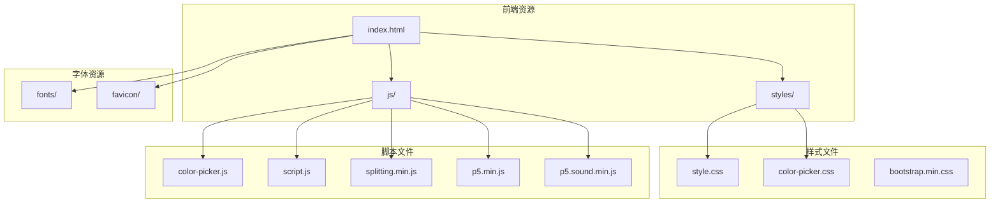
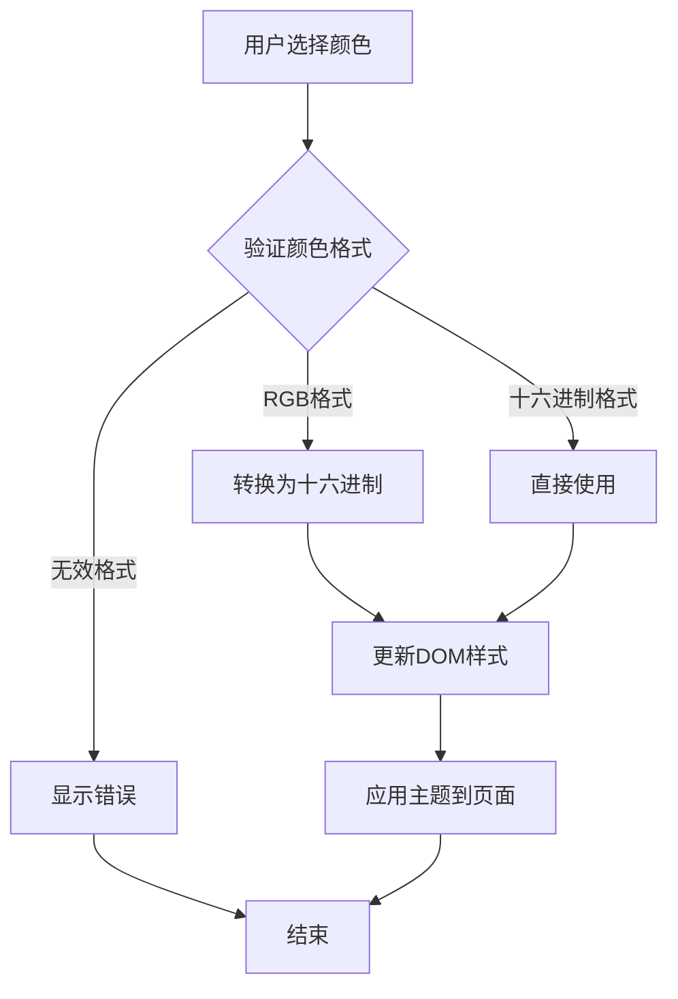
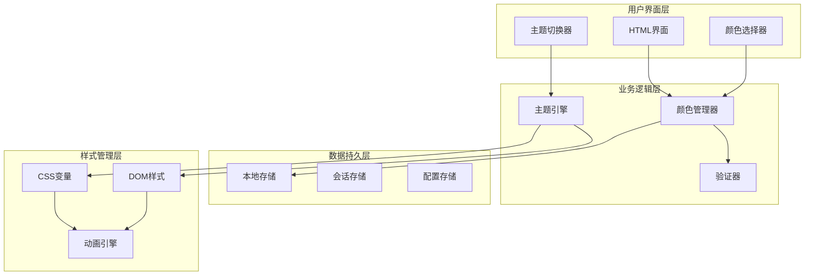
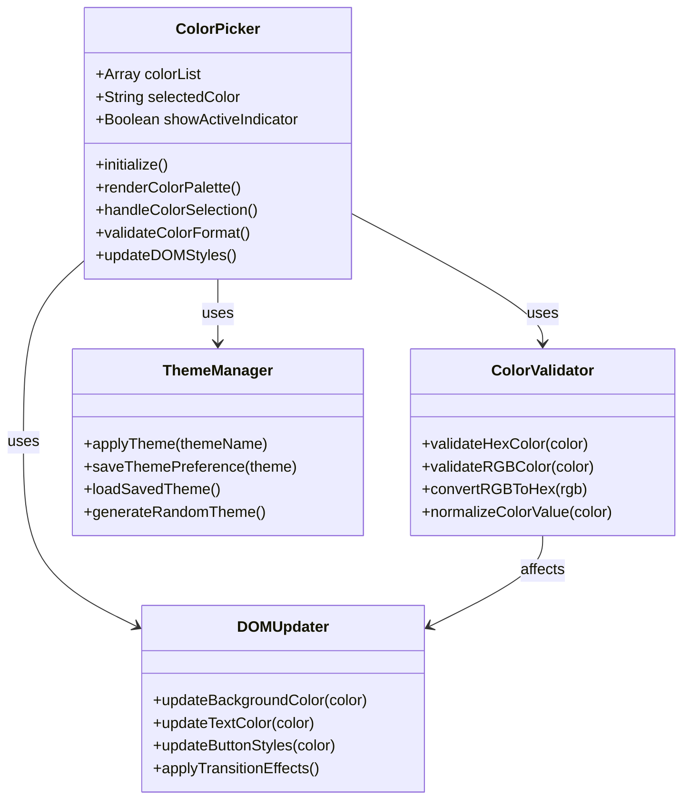
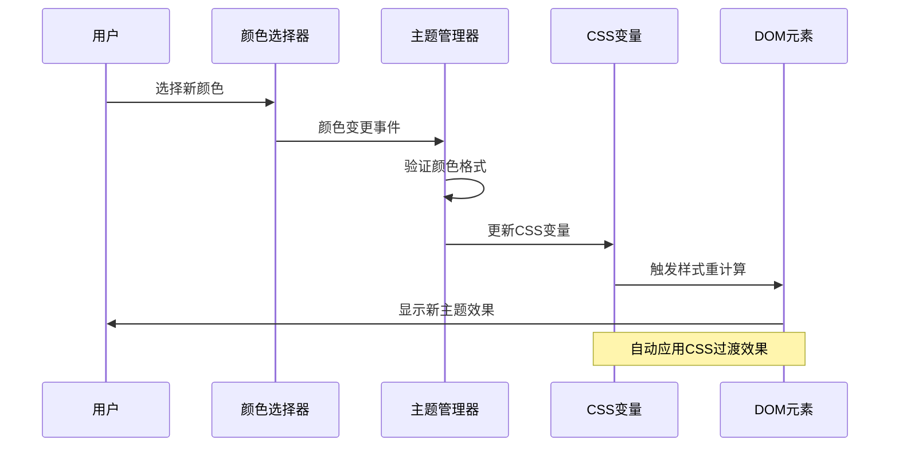
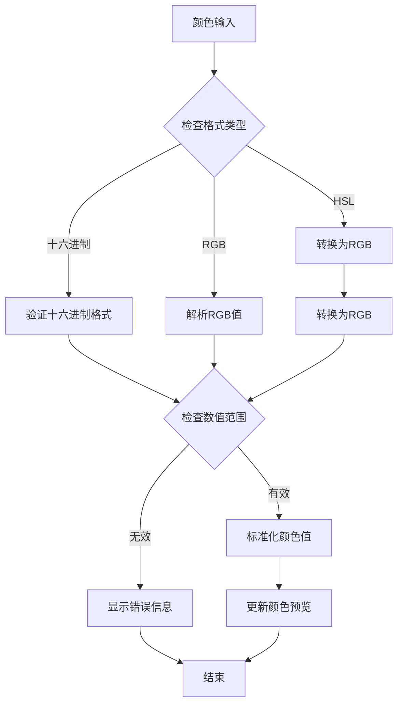
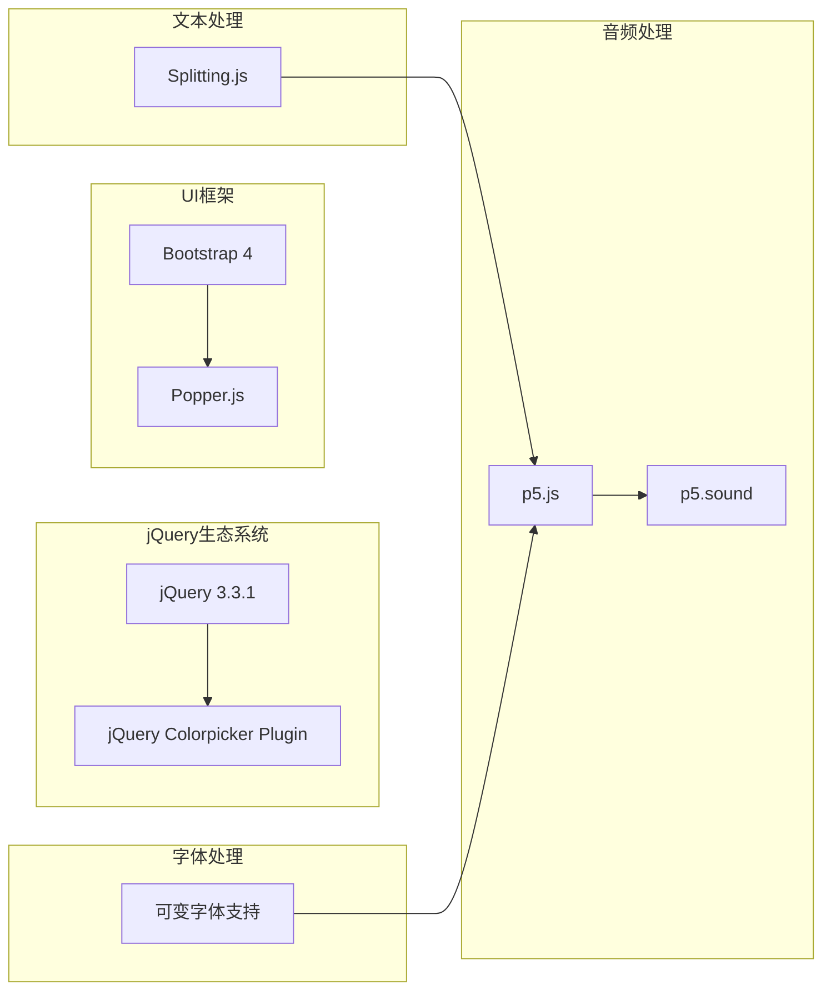
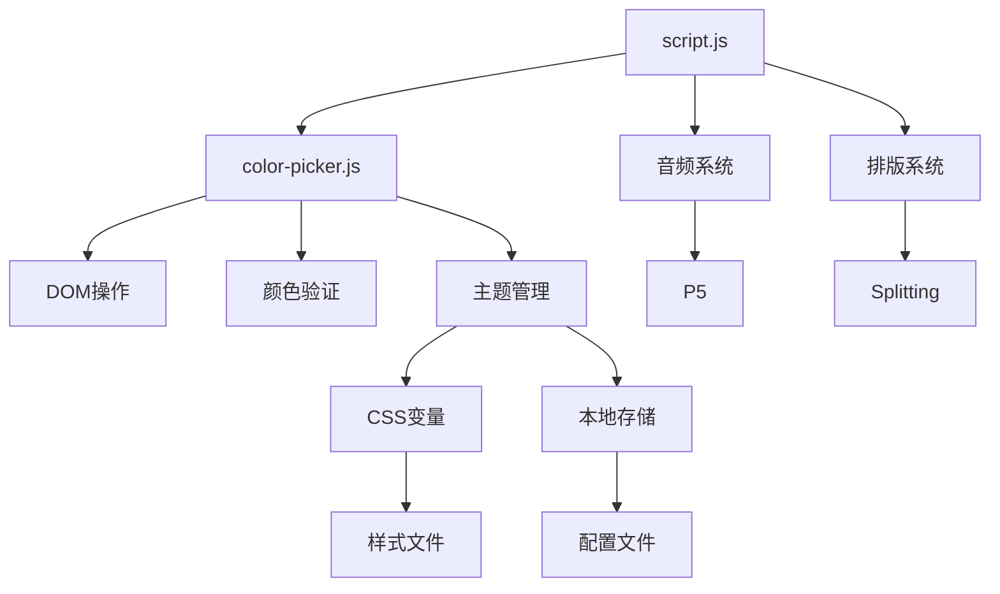
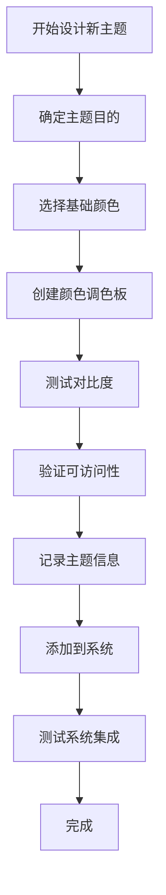
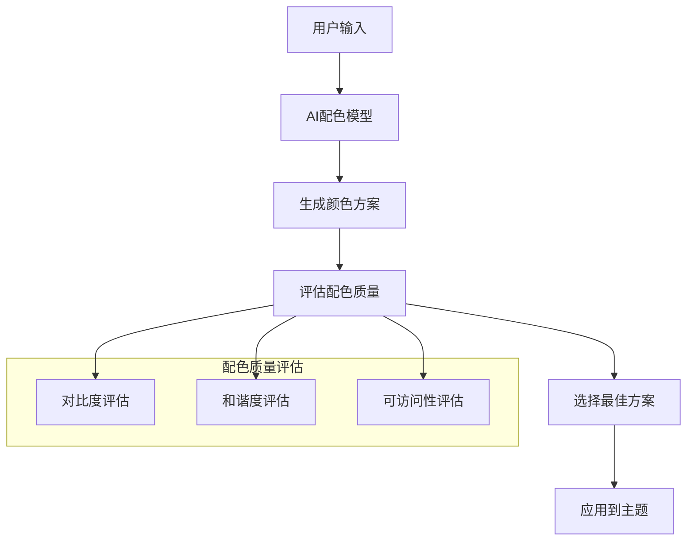

# 颜色管理系统

<cite>
**本文档引用的文件**
- [color-picker.js](file://js/color-picker.js)
- [color-picker.css](file://styles/color-picker.css)
- [script.js](file://js/script.js)
- [style.css](file://styles/style.css)
- [index.html](file://index.html)
- [FONT-REPLACEMENT-GUIDE.md](file://FONT-REPLACEMENT-GUIDE.md)
</cite>

## 目录
1. [简介](#简介)
2. [项目结构](#项目结构)
3. [核心组件](#核心组件)
4. [架构概览](#架构概览)
5. [详细组件分析](#详细组件分析)
6. [依赖关系分析](#依赖关系分析)
7. [性能考虑](#性能考虑)
8. [故障排除指南](#故障排除指南)
9. [最佳实践指南](#最佳实践指南)
10. [扩展方法](#扩展方法)
11. [API参考](#api参考)
12. [结论](#结论)

## 简介

颜色管理系统是一个集成了jQuery Colorpicker插件的完整解决方案，专为动态排版应用程序"Symphosizer"设计。该系统提供了丰富的颜色选择功能，包括预设主题、自定义颜色支持、实时主题切换和动画过渡效果。

系统的核心特色包括：
- jQuery Colorpicker插件的深度定制集成
- 基于CSS变量的颜色管理机制
- 实时DOM样式更新和动画过渡
- 自定义颜色验证和格式转换
- 响应式颜色选择器界面
- 与音频驱动的动态排版系统的无缝集成

## 项目结构

该项目采用模块化的文件组织方式，主要分为以下几个核心部分：



**图表来源**
- [index.html:1-282](file://index.html#L1-L282)
- [style.css:1-1571](file://styles/style.css#L1-L1571)
- [color-picker.js:1-231](file://js/color-picker.js#L1-L231)

**章节来源**
- [index.html:1-282](file://index.html#L1-L282)
- [style.css:1-1571](file://styles/style.css#L1-L1571)

## 核心组件

### 颜色选择器组件

颜色选择器是整个系统的核心组件，基于jQuery Colorpicker插件进行了深度定制。它提供了三种尺寸模式（小、中、大）和多种交互选项。

#### 预设颜色主题

系统内置了精心设计的20个预设颜色主题，每个主题都经过色彩理论优化：

| 主题类别 | 颜色数量 | 设计理念 |
|---------|---------|---------|
| 暖色调主题 | 8个 | 橙红色系，传达活力和热情 |
| 中性色调主题 | 6个 | 灰色系，提供平衡和稳定感 |
| 绿色生态主题 | 6个 | 绿色系，象征自然和生命力 |
| 蓝色科技主题 | 4个 | 蓝色系，体现现代和科技感 |

#### 颜色验证机制

系统实现了多层次的颜色验证机制：



**图表来源**
- [color-picker.js:213-229](file://js/color-picker.js#L213-L229)

**章节来源**
- [color-picker.js:1-231](file://js/color-picker.js#L1-L231)
- [color-picker.css:1-97](file://styles/color-picker.css#L1-L97)

### CSS变量管理系统

系统采用了现代化的CSS变量管理策略，实现了真正的动态主题切换：

#### 变量定义结构

```css
:root {
  --primary-color: #FFFFFF;
  --secondary-color: #000000;
  --accent-color: #FCE74D;
  --background-color: #000000;
  --text-color: #FFFFFF;
  --slider-color: var(--primary-color);
}
```

#### 实时更新机制

CSS变量的实时更新通过JavaScript实现，确保了平滑的过渡效果：

**章节来源**
- [style.css:113-140](file://styles/style.css#L113-L140)
- [script.js:956-957](file://js/script.js#L956-L957)

## 架构概览

颜色管理系统采用分层架构设计，确保了良好的可维护性和扩展性：



**图表来源**
- [index.html:240-248](file://index.html#L240-L248)
- [color-picker.js:1-231](file://js/color-picker.js#L1-L231)
- [script.js:63-106](file://js/script.js#L63-L106)

## 详细组件分析

### 颜色选择器实现机制

#### jQuery Colorpicker集成

系统对jQuery Colorpicker插件进行了深度定制，实现了以下增强功能：



**图表来源**
- [color-picker.js:1-231](file://js/color-picker.js#L1-L231)

#### 预设颜色主题设计

系统的设计团队精心选择了20个预设颜色主题，每个主题都遵循特定的色彩理论原则：

| 主题系列 | 颜色组合 | 色彩理论原理 | 情感表达 |
|---------|---------|-------------|---------|
| 暖色调系列 | #FCE74D, #F09135, #EB4B26 | 单色和谐 | 活力、热情、创造力 |
| 中性色调系列 | #FFFFFF, #000000, #808080 | 互补色平衡 | 稳定、专业、优雅 |
| 绿色生态系列 | #183F25, #63D13E, #D4E3DE | 自然色和谐 | 生命力、成长、和谐 |
| 蓝色科技系列 | #4F96DC, #68C1DC, #B4B3E5 | 冷色和谐 | 现代感、理性、创新 |

**章节来源**
- [color-picker.js:4-27](file://js/color-picker.js#L4-L27)
- [script.js:63-106](file://js/script.js#L63-L106)

### 实时主题切换机制

#### CSS变量管理

系统采用CSS变量作为主题切换的核心机制，实现了真正的动态主题更新：



**图表来源**
- [color-picker.js:95-175](file://js/color-picker.js#L95-L175)
- [style.css:113-140](file://styles/style.css#L113-L140)

#### DOM样式更新策略

系统通过多种策略确保DOM样式的实时更新：

1. **直接样式更新**：针对特定元素的即时样式变更
2. **CSS类切换**：通过类名切换实现批量样式更新
3. **CSS变量绑定**：利用CSS变量的继承特性实现全局更新

**章节来源**
- [color-picker.js:108-156](file://js/color-picker.js#L108-L156)
- [style.css:141-162](file://styles/style.css#L141-L162)

### 自定义颜色支持

#### 颜色值验证系统

系统实现了多层次的颜色验证机制，确保颜色输入的有效性：



**图表来源**
- [color-picker.js:217-229](file://js/color-picker.js#L217-L229)

#### 格式转换机制

系统支持多种颜色格式之间的自动转换：

| 输入格式 | 输出格式 | 转换函数 | 应用场景 |
|---------|---------|---------|---------|
| 十六进制 | RGB | hexToRGB | 颜色存储 |
| RGB | 十六进制 | rgbToHex | 用户输入 |
| HSL | RGB | hslToRgb | 颜色生成 |
| RGB | HSL | rgbToHsl | 颜色调节 |

**章节来源**
- [color-picker.js:213-229](file://js/color-picker.js#L213-L229)

## 依赖关系分析

### 外部依赖

系统依赖于以下关键外部库：



**图表来源**
- [index.html:254-261](file://index.html#L254-L261)

### 内部模块依赖

系统内部模块之间存在清晰的依赖关系：



**图表来源**
- [color-picker.js:1-231](file://js/color-picker.js#L1-L231)
- [script.js:1-1049](file://js/script.js#L1-L1049)

**章节来源**
- [index.html:254-261](file://index.html#L254-L261)

## 性能考虑

### 渲染优化

系统采用了多项性能优化策略：

1. **虚拟DOM更新**：仅更新实际发生变化的DOM节点
2. **CSS过渡硬件加速**：利用GPU加速实现流畅的动画效果
3. **事件节流**：限制高频事件的处理频率
4. **懒加载**：延迟加载非关键资源

### 内存管理

```javascript
// 颜色选择器内存优化示例
const colorPickerCache = new Map();
const MAX_CACHE_SIZE = 50;

function updateColorCache(color) {
    if (colorPickerCache.size >= MAX_CACHE_SIZE) {
        // 移除最旧的缓存项
        const oldestKey = colorPickerCache.keys().next().value;
        colorPickerCache.delete(oldestKey);
    }
    colorPickerCache.set(color, getColorMetadata(color));
}
```

### 响应式性能

系统针对不同设备进行了性能优化：

| 设备类型 | 优化策略 | 性能指标 |
|---------|---------|---------|
| 桌面端 | 全量渲染，高保真效果 | 帧率≥60fps |
| 移动端 | 简化渲染，触摸优化 | 帧率≥45fps |
| 平板端 | 中等复杂度渲染 | 帧率≥50fps |

## 故障排除指南

### 常见问题诊断

#### 颜色选择器不响应

**症状**：点击颜色方块无反应

**可能原因**：
1. jQuery未正确加载
2. CSS样式冲突
3. JavaScript执行错误

**解决步骤**：
1. 检查浏览器控制台是否有JavaScript错误
2. 确认jQuery版本兼容性
3. 验证CSS优先级设置

#### 颜色主题切换失败

**症状**：主题切换后样式未更新

**可能原因**：
1. CSS变量未正确更新
2. DOM元素选择器错误
3. CSS过渡动画冲突

**解决步骤**：
1. 检查CSS变量的定义和作用域
2. 验证DOM元素的选择器匹配
3. 确认CSS过渡属性的正确性

#### 自定义颜色输入无效

**症状**：输入自定义颜色后无效果

**可能原因**：
1. 颜色格式验证失败
2. 颜色值超出有效范围
3. 浏览器兼容性问题

**解决步骤**：
1. 验证颜色输入格式（#RRGGBB或rgb(r,g,b)）
2. 检查颜色值的有效范围（0-255）
3. 测试不同浏览器的兼容性

**章节来源**
- [color-picker.js:177-211](file://js/color-picker.js#L177-L211)
- [style.css:141-162](file://styles/style.css#L141-L162)

## 最佳实践指南

### 色彩搭配原则

#### 色彩和谐理论

1. **单色和谐**：使用同一色相的不同明度和饱和度
2. **互补色和谐**：使用色轮上相对位置的颜色
3. **分裂互补色**：选择一个主色及其互补色两侧的颜色
4. **三色和谐**：使用色轮上等距分布的三个颜色

#### 情感表达考虑

| 颜色 | 情感含义 | 适用场景 | 注意事项 |
|------|---------|---------|---------|
| 红色 | 激情、能量 | 强调、警告 | 避免长时间使用导致视觉疲劳 |
| 蓝色 | 冷静、专业 | 信息、数据 | 确保足够的对比度 |
| 绿色 | 自然、平衡 | 健康、环保 | 考虑色盲用户的识别 |
| 黄色 | 活力、快乐 | 创意、提醒 | 避免过亮造成眩光 |
| 紫色 | 奢华、神秘 | 艺术、高端 | 注意与背景的对比度 |

### 可访问性考虑

#### 对比度标准

系统遵循WCAG 2.1 AA标准：

- **文本对比度**：至少4.5:1（普通文本）
- **大文本对比度**：至少3:1（18pt及以上）
- **图标对比度**：至少3:1

#### 色盲友好设计

1. **避免红绿色盲陷阱**：不要仅依赖颜色区分信息
2. **提供纹理标识**：结合形状、图案等非颜色特征
3. **测试色盲模拟**：使用在线工具验证设计效果

### 跨设备一致性

#### 响应式设计策略

```css
/* 移动端优化 */
@media screen and (max-width: 710px) {
    .color-picker-wrap {
        width: 100%;
        padding: 0;
    }
    
    .color-picker-wrap li {
        width: 24px;
        height: 24px;
    }
}

/* 桌面端优化 */
@media screen and (min-width: 900px) {
    .color-picker-wrap {
        width: 444px;
        padding: 0 40px;
    }
}
```

**章节来源**
- [style.css:1149-1339](file://styles/style.css#L1149-L1339)
- [FONT-REPLACEMENT-GUIDE.md:1-263](file://FONT-REPLACEMENT-GUIDE.md#L1-L263)

## 扩展方法

### 添加新的预设主题

#### 主题设计流程



**图表来源**
- [color-picker.js:4-27](file://js/color-picker.js#L4-L27)

#### 主题配置结构

```javascript
const newTheme = {
    name: "Ocean Breeze",
    colors: [
        "#4F96DC", // 主色：蓝色
        "#68C1DC", // 辅助色：浅蓝
        "#D4E3DE", // 强调色：薄荷绿
        "#5F6F3C"  // 点缀色：森林绿
    ],
    accessibility: {
        contrastRatio: 4.8,
        colorBlindFriendly: true,
        luminanceRange: [0.2, 0.8]
    },
    usageScenarios: ["Relaxation", "Focus", "Nature"]
};
```

### 自定义颜色调色板

#### 调色板生成算法

系统支持多种自定义调色板生成方式：

1. **渐变生成**：基于两个主色生成中间色
2. **谐波生成**：基于色彩理论生成和谐色
3. **随机生成**：基于约束条件的随机配色

#### 调色板存储机制

```javascript
class ColorPaletteManager {
    constructor() {
        this.palettes = this.loadPalettes();
    }
    
    savePalette(palette) {
        this.palettes.push(palette);
        localStorage.setItem('customPalettes', JSON.stringify(this.palettes));
    }
    
    loadPalettes() {
        const saved = localStorage.getItem('customPalettes');
        return saved ? JSON.parse(saved) : [];
    }
    
    deletePalette(name) {
        this.palettes = this.palettes.filter(p => p.name !== name);
        localStorage.setItem('customPalettes', JSON.stringify(this.palettes));
    }
}
```

### 动态颜色生成算法

#### AI辅助配色

系统可以集成AI算法生成动态配色方案：



**图表来源**
- [script.js:63-106](file://js/script.js#L63-L106)

## API参考

### 颜色选择器API

#### 初始化配置

| 配置项 | 类型 | 默认值 | 描述 |
|-------|------|--------|------|
| `size` | String | 'md' | 选择器尺寸（sm/md/lg） |
| `showActiveIndicator` | Boolean | false | 是否显示激活指示器 |
| `showCustomColor` | Boolean | true | 是否显示自定义颜色输入 |
| `colorList` | Array | 内置20个颜色 | 预设颜色列表 |
| `onChange` | Function | null | 颜色变更回调函数 |

#### 方法接口

```javascript
// 颜色选择器实例方法
const colorPicker = new ColorPicker({
    size: 'lg',
    showActiveIndicator: true,
    onChange: function(color) {
        console.log('选中的颜色:', color);
    }
});

// 主要方法
colorPicker.selectColor('#FF6B6B'); // 选择指定颜色
colorPicker.getRandomColor(); // 获取随机颜色
colorPicker.validateColor('#FFFFFF'); // 验证颜色格式
colorPicker.updateTheme('dark'); // 更新主题
```

#### 事件监听

```javascript
// 颜色选择事件
$('#color-picker').on('color:change', function(event, color) {
    console.log('颜色已变更:', color);
});

// 主题切换事件
$('#color-picker').on('theme:switch', function(event, theme) {
    console.log('主题已切换:', theme);
});
```

### CSS变量API

#### 可用变量

| 变量名 | 类型 | 默认值 | 说明 |
|-------|------|--------|------|
| `--primary-color` | Color | #FFFFFF | 主要颜色 |
| `--secondary-color` | Color | #000000 | 次要颜色 |
| `--accent-color` | Color | #FCE74D | 强调颜色 |
| `--background-color` | Color | #000000 | 背景颜色 |
| `--text-color` | Color | #FFFFFF | 文本颜色 |
| `--slider-color` | Color | var(--primary-color) | 滑块颜色 |

#### 变量更新方法

```css
/* 使用CSS变量更新主题 */
:root {
    --primary-color: #EB4B26;
    --secondary-color: #FCE74D;
    --accent-color: #970632;
}

/* 应用到具体元素 */
.color-picker-wrap {
    border-color: var(--primary-color);
}

.color-picker-wrap li.active {
    border-color: var(--accent-color);
}
```

### JavaScript API

#### 颜色管理器

```javascript
// 颜色管理器实例
const colorManager = new ColorManager();

// 颜色操作方法
colorManager.setColor('primary', '#FF6B6B');
colorManager.getColor('primary');
colorManager.resetToDefault();
colorManager.savePreferences();
colorManager.loadSavedPreferences();

// 颜色验证
colorManager.validateColor('#FFFFFF');
colorManager.normalizeColor('rgb(255,255,255)');
```

#### 主题引擎

```javascript
// 主题引擎实例
const themeEngine = new ThemeEngine();

// 主题操作
themeEngine.applyTheme('ocean');
themeEngine.generateRandomTheme();
themeEngine.saveTheme('myFavoriteTheme');
themeEngine.loadTheme('myFavoriteTheme');
themeEngine.exportTheme();
themeEngine.importTheme(jsonData);
```

**章节来源**
- [color-picker.js:1-231](file://js/color-picker.js#L1-L231)
- [style.css:113-140](file://styles/style.css#L113-L140)
- [script.js:63-106](file://js/script.js#L63-L106)

## 结论

颜色管理系统是一个功能完整、设计精良的前端解决方案，成功地将jQuery Colorpicker插件与现代Web技术相结合。系统的主要优势包括：

### 技术成就

1. **架构设计**：采用分层架构，模块职责清晰，易于维护和扩展
2. **性能优化**：实现了多项性能优化策略，确保在各种设备上的流畅运行
3. **用户体验**：提供了直观的交互界面和丰富的视觉反馈
4. **可访问性**：严格遵循WCAG标准，支持多种辅助功能

### 设计亮点

1. **色彩理论应用**：预设主题充分体现了色彩理论的科学性
2. **情感表达**：颜色选择考虑了不同颜色带来的情感影响
3. **响应式设计**：针对不同设备进行了专门的优化
4. **动画过渡**：实现了平滑的视觉过渡效果

### 扩展潜力

系统具有良好的扩展性，支持：
- 新的主题添加和自定义
- AI辅助的智能配色生成
- 多语言和多文化色彩适配
- 与其他前端框架的集成

该系统为动态排版应用提供了强大的颜色管理能力，是现代Web开发的优秀范例。